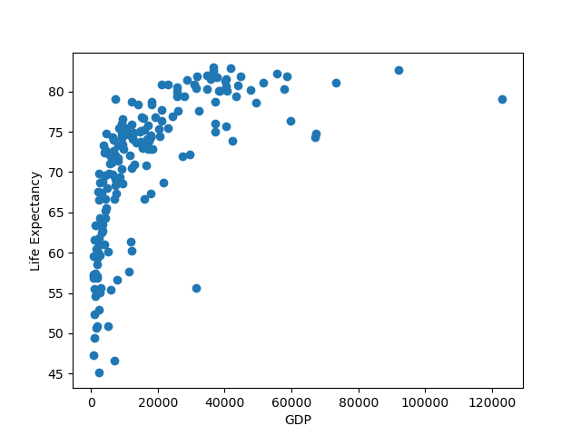
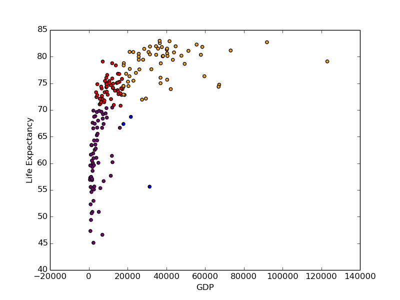
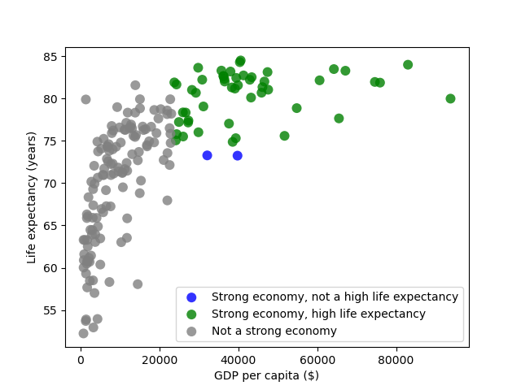
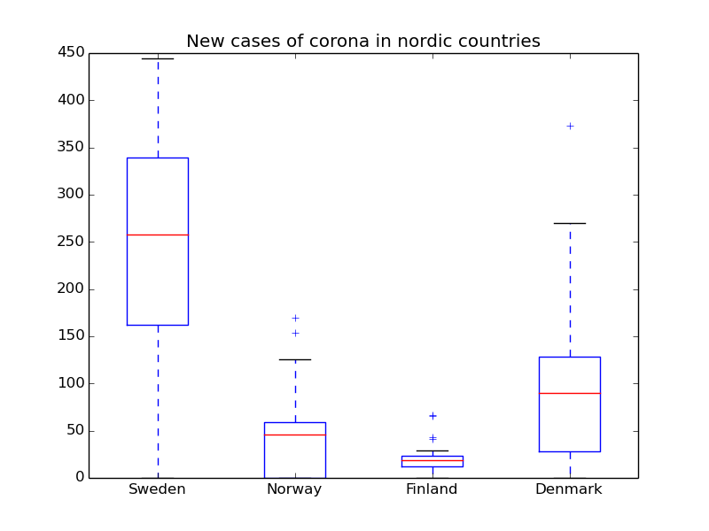
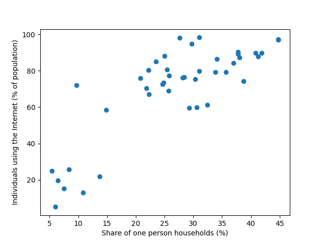
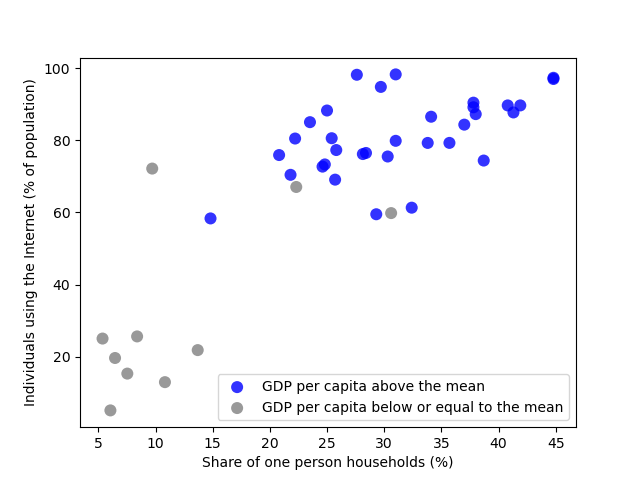
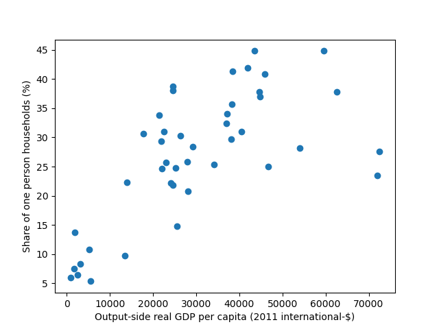
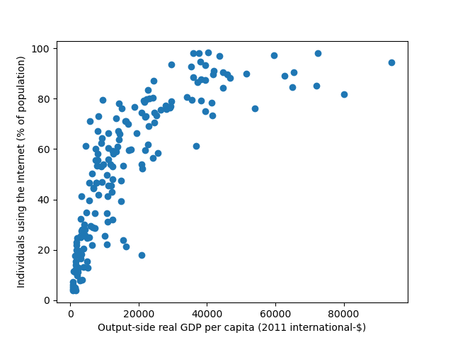
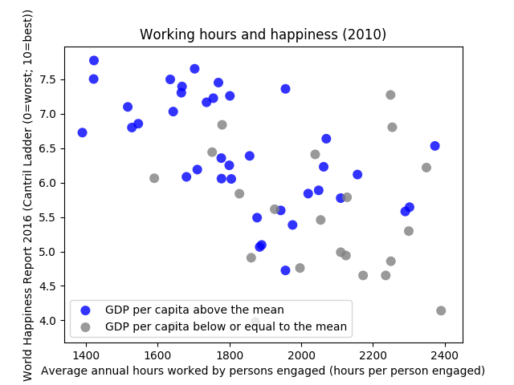
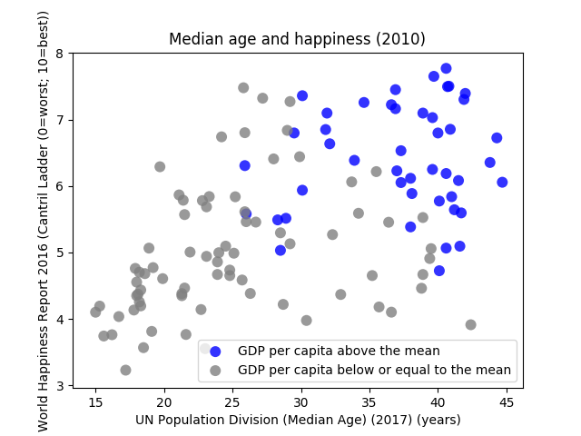

# Assignment 1: Introduction to Data Science and Python

## Tobias Lindroth: x hrs

## Robert Zetterlund: y hrs

# Task 1

### State the Assumptions and decisions

- Decisions

  - We selected two datasets from different sources. We found datasets containing both life expectancy and GDP per capita. But we wanted to use two datasets for the learning experience of merging datasets.
  - We decided to merge the data-sets and only include entities within both.
  - We selected year 2017 because that was the latest year that both our datasets had data from.

- Assumptions
  - We assume that the spelling of countries and the use of the country code are consistent across the datasets.
  - We assume numerical values of the data we plan to plot
  - We assume that the datasets have data over similar countries
  - We assume that the data is correctly formatted according to `.csv-standards`
  - We assume that within a dataset there are no duplicated entries

### A scatter plot of GDP per capita vs life expectancy.



## Question A - Which countries have a life expectancy higher than one standard deviation above the mean?

Out of the 182 entities examined, the following had a life expectancy higher than one standard deviation above the mean:

- Anguilla
- Australia
- Austria
- Belgium
- Bermuda
- Canada
- Cayman Islands
- Cyprus
- Denmark
- Finland
- France
- Germany
- Greece
- Hong Kong
- Iceland
- Ireland
- Israel
- Italy
- Japan
- Luxembourg
- Macao
- Malta
- Netherlands
- New Zealand
- Norway
- Portugal
- Singapore
- Slovenia
- South Korea
- Spain
- Sweden
- Switzerland
- United Kingdom

(33 entities)

Below is a code snippet showing the merging of the datasets, how the mean and standard deviation was created and finally how the countries with one standard deviation above the mean were found.

```python
# merge entries with inner join. Excluding entities not available in both datasets.
merged_entries = pd.merge(gdp_entries, life_entries, on=["Code", "Year", "Entity"])
# Get standard deviation and mean from dataframe
life_std = np.std(merged_entries[LIFE])
life_mean = np.mean(merged_entries[LIFE])
# Filter based on entries which value is larger than mean + one standard deviation
high_life = merged_entries[merged_entries[LIFE] > life_mean+life_std]
```

To asses how reasonable 33 entities are we use an ideal normal distribution of 182 entities. In an normal distribution approximately `15.7% (28 entities)` of the population lies above the range of `mean+sigma`. In our case, `33/182` equals `0.18` (18.1%) which we (without going into more math) deem to be similar.

## Question B - Which countries have high life expectancy but have low GDP?

We assume that a country has a low GDP if their GDP is lower than `0.253` standard deviation below the mean. Meaning that they are a part of the bottom `40%`.

Furthermore, we assume that a high life expectancy is higher than `0.253` standard deviation above the mean. Meaning that they are a part of the top `40%`.

Using these assumptions, the countries that have high life expectancy but low GDP are shown in blue:

- Albania
- Algeria
- Anguilla
- Antigua and Barbuda
- Barbados
- Bosnia and Herzegovina
- Brazil
- China
- Colombia
- Ecuador
- Honduras
- Macedonia
- Maldives
- Morocco
- Peru
- Saint Lucia
- Sri Lanka
- Tunisia
- Turks and Caicos Islands
- Vietnam

(20 entities)



We assume that a high GDP is correlated to high life-expectancy due to having the means to improve living conditions.

To asses how reasonable 20 entities are we think about Venn Diagrams.

- There should be about `40%` of the entities having a high GDP, group named `HG`.
- There should be about `40%` of the entities having a low life expectaction, group named `LE`.
- We define the union between `HG` and `LE` to be `Z`. The percentage of entities within `LE` and `HG` are denoted `X` and `Y` respectively.

<p align="center">

</p>

- If `Z==40 (X,Y=0)`, we have a strong correlation. Meaning that all High GDP entities have a low life expectancy.
- If `Z=0 (X,Y=40)`, we have no correlation at all. No High GDP entities have a low life expectancy.
- We assume that if the distribution were to be completely uncorrelated, we would get `Z = (0.4\*.0.4)100 = 16`.

Our 20 entities is approximately `11%`, `(Z==11=20/182)` of the population, which is lower than a uncorrelated scenario. When we calculate `Z` of high gdp and high life expectation we get `27%` of the total population, which is higher than a uncorrelated scenario. This suggests to us that there is a correlation between high GDP and having a high life expectancy (implying the correlation between a high GDP and **not** having a low life expectancy).

Therefore we find the number of entities reasonable because we believe that the correlation between the high life-expectancy and high gdp are relatively high.

## Question C - Does every strong economy have high life expectancy?

We assume that a GDP higher than `0.253 * standard deviation`, meaning that they are a part of the top 40%, indicates a strong economy.

Using this assumption and the previously stated assumption about a high life expectancy, the countries that have a strong economy, but not a high life expectancy, are:

- Seychelles
- Trinidad and Tobago

The following code snippet displays how the countries with a strong economy but not a high life expectancy were found.

```python
# filter based on having strong economy
strong_economy = merged_entries[
    merged_entries[GDP] > gdp_mean + gdp_std * STD_CONSTANT
]

# filter based on having not high life expectancy
not_high_life_strong_economy = strong_economy[
    strong_economy[LIFE] < life_mean + life_std * STD_CONSTANT
]
```



In total there were 52 countries with a strong economy. Two out of these 52 countries, approximately `4%`, did not have a high life expectancy. This indicates that the correlation between having a high GDP and a high life expectancy is strong. And this strong correlation seems very reasonable since having a strong economy will make it easier to provide good healthcare, living conditions etc. Factors that we assume improves the life expectancy. Therefore, we find the result reasonable.

## Question D - Clean the data

The rows that we removed were those not containing data from the year that we were examining (2017), or the Entity not being available in both datasets. After the removal of rows we decided to remove the columns _Code_ and _Year_ as they were no longer pertaining to the assignment. Important to note is that the information of the dataframe now showing data from the year 2017 is excluded. However, instead of having 2017 repeated through an entire column, we add the year to the column name of Entity. Making `Entity` be `Entity, 2017`. Note that we are aware that this restricts the re-usability of the dataframe, as the convention of naming the field `Entity`, but for the sake of this assignment we allow this.

**We merged the datasets:**

```python
# merge entries with inner join. Excluding entities not available in both datasets.
merged_entries = pd.merge(gdp_entries, life_entries, on=["Code", "Year", "Entity"])
```

**We removed:**

- All the rows that didn't have the year we were interested in.

```python
# Filter based on year
merged_entries = merged_entries[(merged_entries["Year"] == SELECTED_YEAR)]
```

- Columns with data that wasn't used in any of the tasks. Meaning, we removed the "Code" and "Year" columns.

```python
# Drop Code and Year columns, also rename
df_clean = merged_entries.drop(columns=["Code", "Year"])
df_clean = df_clean.rename(columns={GDP: "GDP (2011 international-$)", 'Entity': "Entity, {SELECTED_YEAR}"})

df_clean.head(2)
```

The cleaned data looked like below:

| index | Entity, 2017 | GDP (2011 international-\$) | Life expectancy (years) |
| ----- | ------------ | --------------------------- | ----------------------- |
| 0     | Albania      | 9544.7402                   | 76.562                  |
| 1     | Algeria      | 12590.2260                  | 74.938                  |
| 2     | Angola       | 5988.5347                   | 55.350                  |

# Task 2

## Violin Plot

In this section we present a Violinplot that we made.

### New cases of Covid-19 in August in Sweden, Norway, Denmark and Finland

The graph explores the spread the reporting of new cases of Covid-19 vary in nordic countries during the month of August.


The following code snippet highlights part of the program relevant to creating the violinplot.

```python
# Define which locations that are of interest
locationList = ["Sweden", "Norway", "Finland", "Denmark"]
# Filter based on locationList
entries = df[(df["location"].isin(locationList))]
# Filter based on date being august 2020
entries = entries[(entries["date"].str.contains("2020-08"))]

# Define function for extracting new_cases based on location
def extract_new_cases(location):
    return entries.loc[entries["location"] == location]["new_cases"]

# Create a matrix containing each dataset in an array.
location_data_matrix = [extract_new_cases(location) for location in locationList]

# Boxplot
bp = ax.violinplot(location_data_matrix)
```

## Scatterplots

Below are scatterplots exploring correlation between two datasets.

### Internet usage vs one-person households

The following graph displays the correlation between the percentage of a population in a country that uses the internet and the share of one-person households (2016).



We selected the year 2016 since that was the latest year in which the datasets still had a solid amount of data points. We used two different datasets and made the same assumptions about these datasets as those in task one.

The graph above tells us that there is a correlation between the percentage of a population using the internet and the share of one-person households. A country with a high percentage of internet-users does often have a high share of one-person households. And in opposite, a country with a low percentage of internet users does often have a low share of one-person households. At a first glance this seems reasonable as with the internet you can live alone but still have the everyday interactions with friends and family as you would have if you lived with other people. It is easy to assume that the internet might have increased the share of people who live alone.

However, there might not be a causation at all. By combining the datasets with the GDP per capita-dataset from the previous task and coloring the countries with a GDP per capita above the mean, one notices that almost all the countries that have a high percentage of internet-users and a high share of one-person households also has a high GDP. At the other hand, almost all countries at the opposite end, low percentage of internet-users and low share of one-person households, has a GDP that is below the mean.



This indicates that the correlation between internet usage and one-person households might only exist because of a common factor, the GDP per capita. The comparison below shows the correlation between GDP per capita and an one-person households as well as the correlation between GDP per capita and internet usage.

| GDP per capita vs share of one person households (2016) | GDP per capita vs internet usage (2016) |
| ------------------------------------------------------- | --------------------------------------- |
|                       |        |

Since both the percentage of internet users and share of one-person households have a strong correlation to GDP per capita, it is difficult to say whether internet usage makes people more likely to live alone or if people just like to live alone and will do so if they have enough money.

The insights we have obtained from this is that even though two datasets have a quite clear correlation there might not be a causation. This means that even though it may seem reasonable that a causation exists, the case could be that both depend on a common factor wich causes the correlation.

### Annual working hours per person vs Happiness



The graph explores whether working less increases your happiness. It shows the self-reported life satisfaction on the y-axis and the average annual hours worked per employed persons on the x-axis. The graph shows that there is a correlation between how much an person work and their happiness. whether there is a causation between the two or not is difficult to say but it seems reasonable that the amount of work would affect the happiness as with more work you won't have as much spare time to do things you enjoy and like. Of course, there are also many other factors that affects one's happiness, but it still seems reasonable that there is at least a weak causation between amount of work and happiness.

## The correlation between age and happiness


The graph above explores the notion that being happy makes you live a longer life. At first it looks like it may, however, with the GDP per capita into account it becomes apparent that there might not be a causation between the two.

## Summary

It does appear that GDP per capita has some degree of causation to the other entries selected in our assignment, as entities above the mean _tend_ to cluster or at least be in close proximity to each other. However as there are some outliers we cannot say for sure. For example, discussed in the graph "Working Hours vs Happiness"
