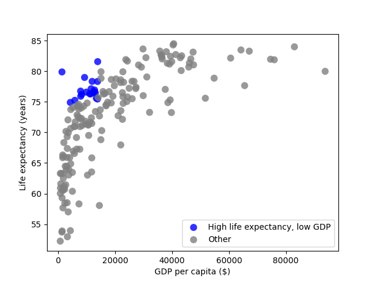
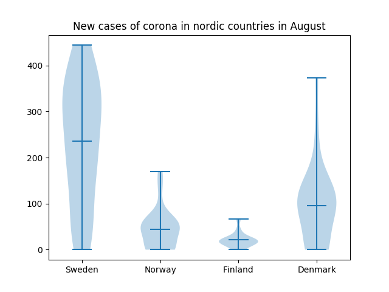

# Report

# Task 1

### State the Assumptions and decisions

- Decisions

  - We selected year 2017 because that was the latest year that both our datasets had data from.
  - We selected two datasets from different sources ...
  -

- Assumptions
  - We assume that the spelling of countries and the use of the country code are consistent across the datasets.
  - We assume numerical values of the data we plan to plot
  - We assume that the datasets have data over similar countries
  - We assume that the data is correctly formatted according to .csv-standards
  - We assume that within a dataset there is no duplicated entries

### Plot


## Question A

The countries that in 2017 had a life expectancy higher than one standard deviation above the mean were:

- Andorra
- Anguilla
- Australia
- Austria
- Belgium
- Bermuda
- Canada
- Cayman Islands
- Channel Islands
- Falkland Islands
- Finland
- France
- Germany
- Greece
- Guadeloupe
- Hong Kong
- Iceland
- Ireland
- Isle of Man
- Israel
- Italy
- Japan
- Liechtenstein
- Luxembourg
- Macao
- Malta
- Martinique
- Monaco
- Netherlands
- New Zealand
- Norway
- Portugal
- Saint Barthlemy
- Saint Martin (French part)
- San Marino
- Singapore
- Slovenia
- South Korea
- Spain
- Sweden
- Switzerland
- Tokelau
- United Kingdom

<!--- Consider whether the results obtained seem
reasonable -->

## Question B

We assume that a country has a low GDP if their GDP is lower than 0.253 standard deviation below the mean. Meaning that they are a part of the bottom 40%.

We assume that a high life expectancy is higher than 0.253 standard deviation above the mean. Meaning that they are a part of the top 40%.

Using these assumptions, the countries that have high life expectancy but low GDP are shown in blue:

- Albania
- Algeria
- Anguilla
- Antigua and Barbuda
- Barbados
- Bosnia and Herzegovina
- Brazil
- China
- Colombia
- Ecuador
- Honduras
- Macedonia
- Maldives
- Morocco
- Peru
- Saint Lucia
- Sri Lanka
- Tunisia
- Turks and Caicos Islands
- Vietnam



```python
# filter on selected year
gdp_entries = df_gdp[(df_gdp["Year"] == SELECTED_YEAR)]
life_entries = df_life[(df_life["Year"] == SELECTED_YEAR)]
# merge dataframes
merged_entries = pd.merge(gdp_entries, life_entries, on=["Code", "Year", "Entity"])

# get standard deviation and mean from entries (same for life_std and life_mean)
gdp_std = np.std(merged_entries[GDP])
gdp_mean = np.mean(merged_entries[GDP])

# filter based on having strong economy
strong_economy = merged_entries[
    merged_entries[GDP] > gdp_mean + gdp_std * STD_CONSTANT
]
```

<!--- Motivera varför våra assumptions är rimliga? --->
<!--- Consider whether the results obtained seem
reasonable -->

## Question C

We assume that a GDP higher than one standard deviation above the mean indicates a strong economy.

Using this assumption and the previously stated assumption about a high life expectancy, the countries that have a strong economy, but not a high life expectancy, are:

- Aruba
- Bahrain
- Brunei
- Denmark
- Kuwait
- Oman
- Qatar
- Saudi Arabia
- Taiwan
- United Arab Emirates
- United States

<!--- Motivera varför våra assumptions är rimliga? --->
<!--- Consider whether the results obtained seem
reasonable -->

## Question D

**We merged the datasets:**

```python
# merge entries with inner join. Excluding entities not available in both datasets.
merged_entries = pd.merge(gdp_entries, life_entries, on=["Code", "Year", "Entity"])
```

**We removed:**

- All the rows that didn't have the year we were interested in.

```python
# Filter based on year
merged_entries = merged_entries[(merged_entries["Year"] == SELECTED_YEAR)]
```

- Columns with data that wasn't used in any of the tasks. Meaning, we removed the "Code" and "Year" columns.

```python
# Drop Code and Year columns, also rename
df_clean = merged_entries.drop(columns=["Code", "Year"])
df_clean = df_clean.rename(columns={GDP: "GDP (2011 international-$)"})

df_clean.head(2)
```

| index | Entity  | GDP ((2011 international-\$)) | Life expectancy (years) |
| ----- | ------- | ----------------------------- | ----------------------- |
| 0     | Albania | 9544.7402                     | 76.562                  |
| 1     | Algeria | 12590.2260                    | 74.938                  |
| 2     | Angola  | 5988.5347                     | 55.350                  |

<!--- Något om att vi funderade på att ta bort alla rader som ej blev "utvalda" av varken task A, task B, task C ? --->

# Task 2

## Boxplots

In this section we present Boxplots that we made.

### New cases of Covid-19 in August in Sweden, Norway, Denmark and Finland

The following code snippet highlights part of the program relevant to creating the boxplot-graph.

```python
# Define which locations that are of interest
locationList = ["Sweden", "Norway", "Finland", "Denmark"]
# Filter based on locationList
entries = df[(df["location"].isin(locationList))]
# Filter based on date being august 2020
entries = entries[(entries["date"].str.contains("2020-08"))]

# Define function for extracting new_cases based on location
def extract_new_cases(location):
    return entries.loc[entries["location"] == location]["new_cases"]

# Create a matrix containing each dataset in an array.
location_data_matrix = [extract_new_cases(location) for location in locationList]

# Boxplot
bp = ax.boxplot(location_data_matrix)
```

The graph explores the spread the reporting of new cases of Covid-19 vary in nordic countries during the month of August.


## Scatterplots

Below are scatterplots exploring correlation between two datasets.

### Annual working hours per person vs Happiness


The graph shows that there is some correlation between how much you work and your happiness. It seems reasonable that the amount of work would affect the happiness as with more work you won't have as much spare time to do things you enjoy and like. Of course, there are also many other factors that affects one's happiness, but it still seems reasonable that there are at least a weak causation between amount of work and happiness.

<!--- Eventuellt något om att working hours inte tar med  arbetslösa? Många som jobbar 0 timmar är förmodligen inte glada? --->

### Internet usage vs one person households

The graph shows that there is some correlation between the percentage of the population that uses the internet and the share of one person households.


## The correlation between age and happiness

The following graphs explores the notion that being happy makes you live a longer life.


