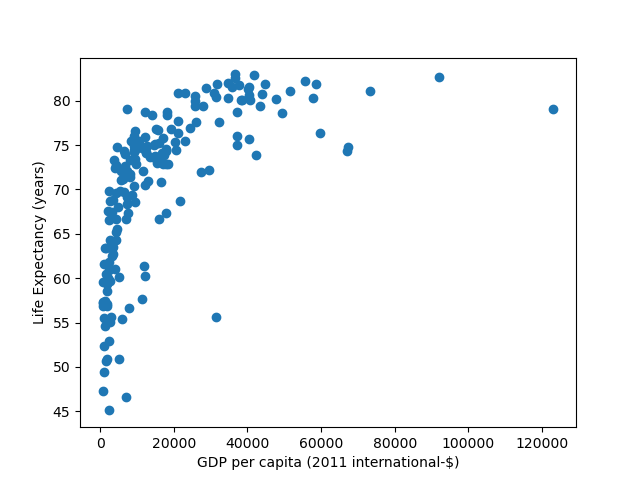

# Report

# Task 1

### State the Assumptions and decisions

- We selected year 2010

### Plot

## Question A

The countries that in 2010 had a life expectancy higher than one standard deviation above the mean were:

- Andorra
- Anguilla
- Australia
- Austria
- Belgium
- Bermuda
- Canada
- Cayman Islands
- Channel Islands
- Falkland Islands
- Finland
- France
- Germany
- Greece
- Hong Kong
- Iceland
- Ireland
- Isle of Man
- Israel
- Italy
- Japan
- Liechtenstein
- Luxembourg
- Macao
- Malta
- Martinique
- Monaco
- Netherlands
- New Zealand
- Norway
- San Marino
- Singapore
- South Korea
- Spain
- Sweden
- Switzerland
- United Kingdom

<!--- Consider whether the results obtained seem
reasonable -->

## Question B

We assume that a country has a low GDP if the the GDP is lower than one standard deviation below the mean.

We assume that a high life expectancy is higher than one standard deviation above the mean.

Using these assumptions, the countries that have high life expectancy but low GDP are:

None

<!--- Motivera varför våra assumptions är rimliga? --->
<!--- Consider whether the results obtained seem
reasonable -->

## Question C

We assume that a GDP higher than one standard deviation above the mean indicates a strong economy.

Using this assumption and the previously stated assumption about a high life expectancy, the countries that have a strong economy, but not a high life expectancy, are:

- Aruba
- Bahrain
- Brunei
- Denmark
- Kuwait
- Oman
- Qatar
- Saudi Arabia
- Taiwan
- United Arab Emirates
- United States

<!--- Motivera varför våra assumptions är rimliga? --->
<!--- Consider whether the results obtained seem
reasonable -->

## Question D

We removed:

- All the rows that didn't have the year we were interested in.
- Columns with data that wasn't used in any of the tasks. From both the life expectancy dataset and the gdp dataset we removed the "Code" and "Year" columns.

<!--- Något om att vi funderade på att ta bort alla rader som ej blev "utvalda" av varken task A, task B, task C ? --->

# Task 2

## Annual working hours per person vs Happiness

The graph shows that there is some correlation between how much you work and your happiness. It seems reasonable that the amount of work would affect the happiness as with more work you won't have as much spare time to do things you enjoy and like. Of course, there are also many other factors that affects one's happiness, but it still seems reasonable that there are at least a weak causation between amount of work and happiness.

<!--- Eventuellt något om att working hours inte tar med  arbetslösa? Många som jobbar 0 timmar är förmodligen inte glada? --->

## Internet usage vs one person households

The graph shows that there is some correlation between the percentage of the population that uses the internet and the share of one person households.

## New cases of Covid-19 in August in Sweden, Norway, Denmark and Finland

