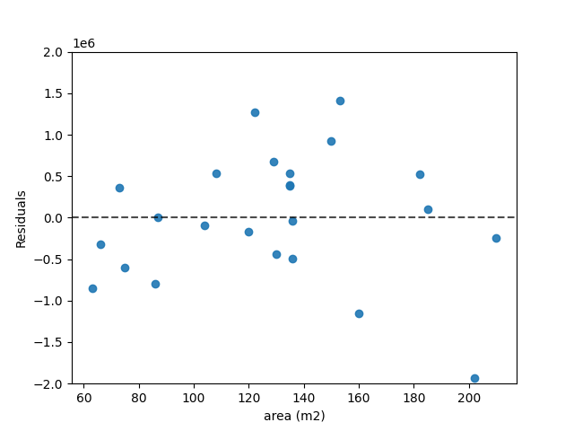

##  *Question 1*

## Task A
The value of the slope is 20337.24227955
The value of the intercept is 2073775.80393474

## Task B
- The predicted value of a house with 100 m2 is 4107500.03188952 kr

- The predicted value of a house with 150 m2 5124362.14586691 kr

- The predicted value of a house with 200 m2 6141224.25984429 kr

## Task C

## Task D

### Regarding our results

Our model estimates the house price of a house with x m2 to 

price = 20337.24227955*x + 2073775.80393474

That is, for every square meter the price increases with around 20 000 kr. 

The model has some problems. For example it estimates the price of 0 square meters to around 2 million kr. Furthermore, it underestimates one house by around 2 million kr. 

<!--- Regarding the results.
#   our R-squared "score" is 0.543,
#   Perhaps perform the 
# --->

### How could the model be improved 

The model can be improved in several different ways

- Adding a datapoint at (0,0) will create a more realistic model.
- Not assuming that there is a linear relationship. It might not be the case that the data is linear. 
- More datapoints will give a more precise model.
- Take more factors into account
    - Area of land in measurement
    - Year of building the house
    - Is it newly renovated
    - Is there any additional living space (biarea)
    - Annual cost of keeping the property
    - Where is it located? Near city centre or not? Close to school and public transport?
    - How is the neighbourhood?
<!--- # More datapoints
# There are more factors to take into account
# Area of land in measurements
# Year of building the house
# Is it newly renovated?
# Do we have additional living space? (biarea)
# What is the annual cost of keeping the property?
# Where is it located? Near city centre or not?
--->