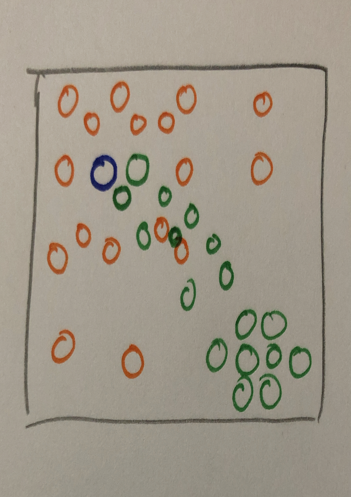

# Assignment 2: Regression and classification

## Tobias Lindroth: x hrs

## Robert Zetterlund: y hrs

---

## _Question 1_

## Task A

<!-- What are the values of the slope and intercept of the regression line? -->

- slope: 20337
- intercept: 2073775

```python
# [:regression-line.py:]

# Create linear regression model
1: reg = LinearRegression()
# Fit model to data from hemnet
2: reg.fit(x, y)
# Get slope and intercept
4: slope = reg.coef_ # = 20337
5: intercept = reg.intercept_ # = 2073775

```

## Task B

<!-- Use this model to predict the selling prices of houses which have living area
222 100m ,150m and200m . -->

Using the slope and the intercept values we create a regression line (`f(x) = kx + m`)

```python
1:  def f(x):
2:      return 20337*x + 2073775
```

|                          |
| :--------------------------------------------------------------------: |
| _Figure 1: A scatter plot of the data values with the regression line_ |

Using our model we predict prices for houses with the area of 100,150 and 200 m2.

```python
f(100) = 4107500
f(150) = 5124362
f(200) = 6141224
```

## Task C

<!-- Draw a residual plot. -->

```python
# [:residuals.py:]

# use regression fit to get predicted y values.
y_predicted = reg.predict(x)
# calculate residuals
residuals = y-y_predicted

# scatterplot residuals
plt.plot(x, residuals, 'o', alpha=0.9)
# create horizontal line to show the prediction of the linear regression
plt.axhline(y=0, ls="--", alpha=0.7, color="black")
```

|                                                                                  |
| :------------------------------------------------------------------------------------------------------------------: |
| _Figure 2: A residual plot with the residuals on the vertical axis and the area of the house on the horizontal axis_ |

## Task D

<!-- Discuss the results, and how the model could be improved. -->

### Regarding the results.

The model we have created has some issues. According to the model, it is very expensive to buy small houses. For example, 0 m2 costs 2 000 000 kr. Furthermore, in the residual plot one can see that the model often underestimate or overestimate the price of a house by quite a lot. One house is underestimated by 2 000 000 kr.

The coefficient of determination of the predictions is around 0.53. This basically means that 53 % of the variation in y can be explained by the x-variables or in other words, 53 % of the prices can be predicted by the area of the house. Becuase of this, our model does not seem to be very reliable.

### Improvements

- Adding a datapoint at (0,0) will create a more realistic model.
- Adding more datapoints will give a more precise model.
- Take more factors into account
  - Area of land in measurements
  - Year of building the house
  - Is it newly renovated?
  - Do we have additional living space? (biarea)
  - What is the annual cost of keeping the property?
  - Where is it located? Near city centre or not? Near schoold and public transport?

# Task 2

<!-- Use a confusion matrix to evaluate the use of logistic regression to classify the iris data set. Use the one-vs-rest option to use the same setup as in the lectures for multiclass regression -->

The code snippet below shows how the confusion matrix of the logistic regression model was caluclated. On line 5, note that we allot 33 % of the data to a testing set and the rest to a training set.

```python
# [:confusion-matrix.py:]

# Load iris dataset and get data and classification
1. bunch = load_iris()
2. X = bunch["data"]
3. y = bunch["target"]

# Get classnames (setosa, versicolor, virginica)
4. class_names = bunch["target_names"]

# divide into training and test data
5. X_train, X_test, y_train, y_test = train_test_split(X, y,
6.      test_size=0.33, random_state=42)

# Train one logistic classifier for each class
7. clf1 = OneVsRestClassifier(LogisticRegression()).fit(X_train, y_train)

# Create confusion matrix
8. plot_confusion_matrix(clf1, X_test,y_test,
        display_labels=class_names, cmap=plt.get_cmap("Blues"))
```

|                      |
| :-----------------------------------------------------------------------------: |
| _Figure 3: Confusion matrix for classification model using logistic regression_ |

In the confusion matrix above, see figure 3, one can see that the logistic regression model performed fairly well on the unseen dataset. It only failed to predict two points correctly, as it predicted two versicolor as virginica.

# Task 3

Below is a multi matrix plot that shows confusion matrices for different values of k. Blue matrices have distribution set to "uniform", green ones have it set to "distance".

Code is almost identical to above, except we use `KNeighborsClassifier` on line 5 and create multiple plots in a figure.

```python
# [:k_nearest.py:]

# decide values for k and distributions
1. n_neighbors_array = np.array([1, 5, 50, 100])
2. distributions = ['uniform', 'distance']

3. for n_neighbors in n_neighbors_array:
4.     for weights in distributions:
            # create an instance of Neighbours Classifier and fit the data.
5.          clf = neighbors.KNeighborsClassifier(n_neighbors, weights=weights)
6.          clf.fit(X_train, y_train)
            # Calculate placement of plot (row,col)
            # Create confusion matrix, code similar to task2
```

|                                                   |
| :--------------------------------------------------------------------------------------------------------: |
| _Figure 4: The confusion matrixes of the different classification models generated by k-nearest-neighbour_ |

By looking at the top row of confusion matrices displaying an _uniform_ distribution, we notice that the accuracy decreases through `k=1,5,50,100`.

By looking at the bottom row of confusion matrices displaying an _distance_ distribution, we notice that the accuracy is improved through `k=1,5,50,100`.

## To answer the question "What will happen when k grows larger for the different cases? Why?"

First we will look at our data in "Our examples", then we will add other thoughts in the other section, "Our thoughts in general"

### Our examples

We note that we have allotted 50 (33%) of the datapoints to _testing_, being: 19 setosa, 15 versicolor and 16 virginica.
This means that we have _trained_ our model on 100 (66%) datapoints: 31 setotas, 35 versicolor and 34 virginica.

|              | setosas |  versicolor   | virginica | total |
| :----------: | :-----: | :-----------: | :-------: | :---: |
| **testing**  |   19    |      15       |    16     |  50   |
| **training** |   31    |      35       |    34     |  100  |
|  **total**   |   50    |      50       |    50     |  150  |


We start of by inspecting the results of `k=100` (shown rightmost in figure 4) with uniform distribution. Here, all predictions are versicolor, which has a reasonable explaination. View the distribution in the training set, we have a majority of virginica. If the model were to evaluate any given testing point's 100 nearest neigbors, their distribution would be equal to the training data. As the distribution is uniform, they are all equal in weight and the point will be classified as virginica.

The model using `k=100` with _distance_ distribution performs much better, being able to accurately predict labels for all datapoints. This difference is because it assigns different weights to neighbors based on distance.

We now inspect `k=1` with uniform distribution. Here, the predictions are very good, a majority being correct. When evaluating a point, the model simply labeled each testing point to be the same as their closest neighbor. We note that when `k=1` the choice of distribution does not matter, as only one neighbor is sought after. See below in figure 5a,b, two 3-class classifications with `k=1`, with separate distributions, having identical plots.

|  |  |
| :-------------------: | :-------------------: |
|       Figure 5a       |       Figure 5b       |

### Our thoughts in general

Compare the following two 3-class classifications obtained via scikit-learn documentation shown below in figure 6.

|  |  |
| :----------------------: | :-----------------------: |
|        Figure 6a         |         Figure 6b         |

[_A small note on the colors in the figure: A testing point will be classified according to which color it is placed within, for example point `P =(4,4)` will be placed within the orange area, and classified as such._]

Note that the cyan area at `x=7,y=2.8` varies in size dependent on whether or not the distribution is 'distance' or 'uniform'.
We believe this is because that the ability to form "mini-clusters" (where `mini<k/2`) becomes very difficult in uniform distributions. Uniform distributions, evaluates neighbors equally and purely by the amount. Although a point closely surrounded by many points labeled `virginica`, given an large enough `k`, they can be classified with another label `versicolor`.

Now compare the cluster located at `(x,y) = (5, 2.4)` in the 3-class classifications with different values of k and a uniform distribution, shown below in figure 7.

|  |  |
| :-------------------: | :--------------------: |
|       Figure 7a       |       Figure 7b        |

At `(x,y) = (5, 2.4)` there are 3 cyan points closely coupled together, indicating that similar points might also be cyan. This is supported by the left figure where `k=5`, in which the color of the area is cyan. This is not supported by the right figure where `k=75`, in which the color of the area is orange. In this case, we deem `k=5` to be the better value for `k`.

### Using an example to show our thought process
Below in Image 1 we show a scenario for the KNNeighbors model when instructed to classify the blue point. The following table show what we predict how the model behaves for different values of k and distributions.

<p align="center">
  
  <p align="center"> Image 1: An classification problem for KNNeighbors algorithm which is instructed to classify the blue point as either orange or green<p>
</p>

|              |                        1 < k < 3                         |                        3 < k < 7                         |                                                        7 < k                                                         |
| :----------: | :------------------------------------------------------: | :------------------------------------------------------: | :------------------------------------------------------------------------------------------------------------------: |
| **uniform**  |  |  |                                                              |
| **distance** |  |  |  or  |


Intuitively, **we** would classify the blue point as green. It looks as if it is the continuation of the green body. To follow our intuition, we should pick a low value of `k`. We do realize that the value of `k` is related to to size of the dataset, and that our intuition can be wrong. We have created some guidelines that we could think of regarding picking the value of `k` and choosing distribution.

* If you are using an uniform distribution and have __few__ labels, `k<2*(min(#label))` should hold. Essentially it says that `k` should be larger than the number of datapoints with the least used label in the training data. If it does not hold, it becomes difficult to label a datapoint to the least used label (supported by our above discussion where our model used uniform distribution and `k=100` and classified all points as `versicolor` for the iris data set).

* We think that if you have a dataset that is intertwined to some extent, it is important to use distance as distribution, as it allows for outliers given a small enough `k`.

<!--Distance distribution however, evaluates neighbors based on the distance to them, more specifically `1/distance`. Let us use the same two k values and compare in the figure below.

|                       |                        |
| --------------------- | ---------------------- |
|  |  |
-->

<!-- 3... Use k-nearest neighbours to classify the iris data set with some different values for k, and with uniform and distance-based weights. What will happen when k grows larger for the different cases? Why? -->

# Task 4

<!-- 4... Compare the classification models for the iris data set that are generated by k- nearest neighbours (for the different settings from question 3) and by logistic regression. Calculate confusion matrices for these models and discuss the performance of the various models. -->

By comparing the classification models created with k-nearest-neighbours and the one using logistic regression, we can decide which classifier works best for classyfing iris-flowers.

In the confusion matrixes above, see figure 3 for k-nearest neighbour models and figure 2 for the logistic regression model, we see that

- When `k=1` or `k=5` and the weight is uniform knn performs better than logistic regession.

- When the weight is distance knn performs better no matter what `k`.

When we however pick a "bad" k and weight, the logistic regression classification model works better. For example, if k is 50 and the distribution is uniform, the confusion matrixes shows that knn performs worse than logistic regression.

Hence, K-nearest-neighbour performs better than logistic regression if you manage to choose a good k and weight. Note however that this is only the result from our case. There might be cases when logistic regression works better than k-nearest-neighbours no matter what k or distribution you choose.

We have already discussed which of the models generated by k-nearest neighbour performed the best in task 3 and hence we will not do it again in this task.

# Task 5

We believe it is important to use a seperate test set because you want your model to perform well on unseen data. If you don't split the data into training and test data, but instead use all data for both training and testing, your model won't generalize well for unseen data. Your model will always do well on the "test" data as it is the same data that has been used for the training, but when tasked to predict unseen data, the results probably will not be as good.

If you at the other hand do split the data into training and test data, you will be able to compare different models and see which does best on the unseen test data. If you then a find a model that performs well on the unseen test data, you can be more confident that it will predict any new unseen data quite well.

<!-- Explain why it is important to use a separate test (and sometimes validation) set -->

Overfitting?
