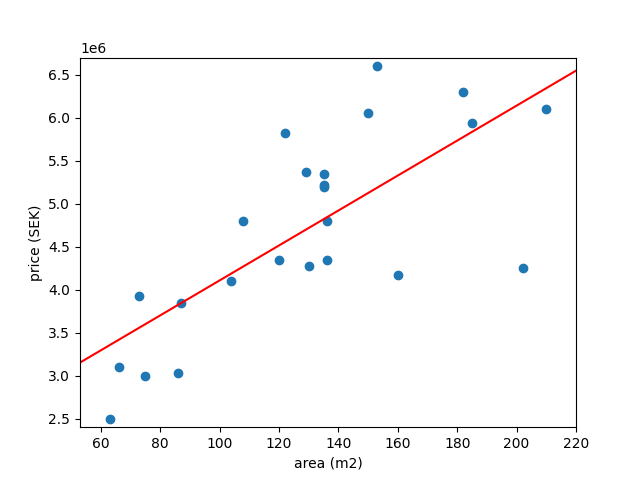
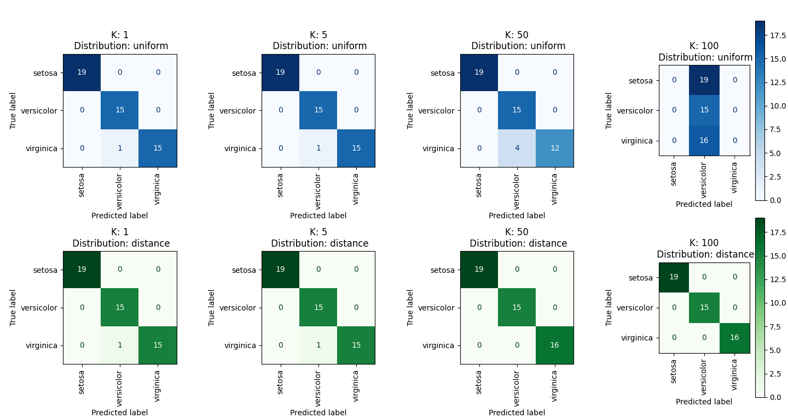

##  *Question 1*

## Task A 
<!-- What are the values of the slope and intercept of the regression line? -->

   * slope: 20337
   * intercept: 2073775


## Task B
<!-- Use this model to predict the selling prices of houses which have living area
222 100m ,150m and200m . -->

Using the slope and the intercept values we create a regression line (`f(x) = kx + m`)

```python
f(x) = 20337*x + 2073775
```


Using our model we predict prices for houses with the area of 100,150 and 200 m2.

```python
f(100) = 4107500
f(150) = 5124362
f(200) = 6141224
```

## Task C
<!-- Draw a residual plot. -->


## Task D 
<!-- Discuss the results, and how the model could be improved. -->
### Regarding the results.

The model we have created has some problems. According to the model, it is very expensive to buy small houses. For example, 0 m2 costs 2 000 000 kr. Furthermore, in the residual plot one can see that the model often underestimate or overestimate the price of a house by quite a lot. One house is underestimated by 2 000 000 kr. 

The coefficient of determination of the predictions is around 0.53. This basically means that 53 % of the variation in y can be explained by the x-variables or in other words, 53 % of the prices can be predicted by the area of the house. Becuase of this, our model does not seem to be very reliable.


### Improvements
- Adding a datapoint at (0,0) will create a more realistic model. 
- Adding more datapoints will give a more precise model.
- Take more factors into account
    * Area of land in measurements
    * Year of building the house
    * Is it newly renovated?
    * Do we have additional living space? (biarea)
    * What is the annual cost of keeping the property?
    * Where is it located? Near city centre or not? Near schoold and public transport?


# Task 2 
<!-- Use a confusion matrix to evaluate the use of logistic regression to classify the iris data set. Use the one-vs-rest option to use the same setup as in the lectures for multiclass regression -->


# Task 3

<!-- Use k-nearest neighbours to classify the iris data set with some different values for k, and with uniform and distance-based weights. What will happen when k grows larger for the different cases? Why? --> 

# Task 4

<!-- Compare the classification models for the iris data set that are generated by k- nearest neighbours (for the different settings from question 3) and by logistic regression. Calculate confusion matrices for these models and discuss the performance of the various models. -->




# Task 5

<!-- Explain why it is important to use a separate test (and sometimes validation) set -->

Overfitting?
