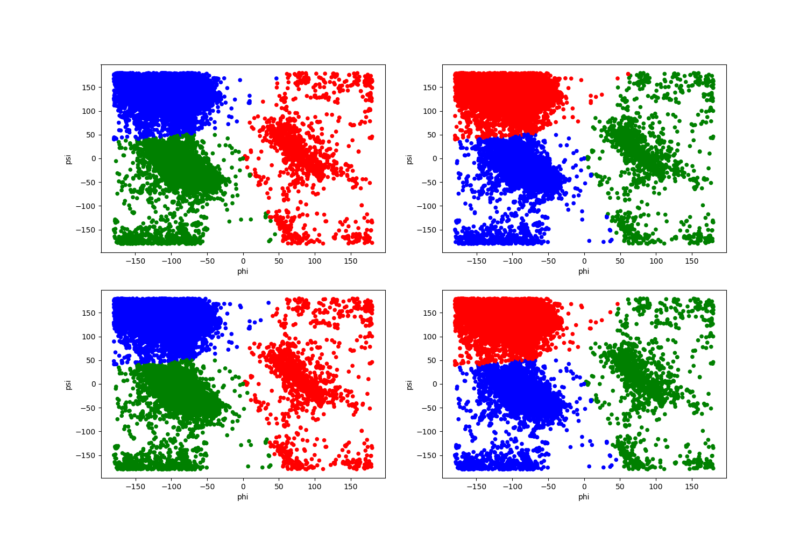
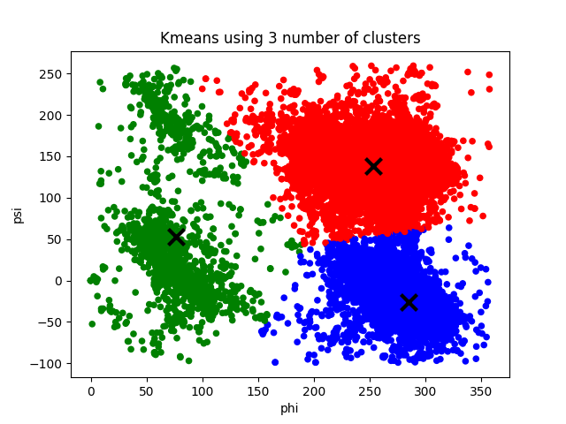

# Assignment 3: Clustering

## Tobias Lindroth: x hrs

## Robert Zetterlund: x hrs

---

## _Question 1_ - Robert

<!-- 1. Show the distribution of phi and psi combinations using:
a. A scatter plot

b. A heat map
-->

### Scatterplot
<p align="center">
    
    <p align="center">Figure: <p>
<p>

### Heatmap

<p align="center">
    
    
    <p align="center">Figure 2: <p>
<p>

## _Question 2_ - 
<!-- 
Use the K-means clustering method to cluster the phi and psi angle combinations in the data file.
a. Experiment with different values of K. Suggest an appropriate value of K for this task and motivate this choice.
-->

By trying  out different k-values we notice that k=3 or k=4 have the most reasonable clusters. With a k < 3, the clusters does not explain the variation, and with a k > 4 it seems like we are trying to create clusters where there should not be clusters, i.e we are overfitting. 

<p align="center">

    
    
       
    <p align="center">Figure 3: The clusters created using k-means for different k. <p>
<p>

By using an elbow curve we can get an indication to what k-value fits the data best, that is, how many clusters we should use. In the figure below we can clearly see an elbow at k=3, hence the elbow curves indicates that 3 clusters is the best fit. 

### Elbow curve
<p align="center">
    
    <p align="center">Figure 4: The elbow curve <p>
<p>

The calculation of the elbow curve was done by:

 For each k (k=2 to k=10), taking the sum of the squared distances of samples to the nearest cluster centre. See the code snippet below. 

```python
distorsions = []
for k in range(2, 10):
    kmeans = KMeans(n_clusters=k)
    kmeans.fit(X)
    distorsions.append(kmeans.inertia_)

#inertia is the sum of squared distances of samples to    their closest cluster center.    
```

Since both our own experiment with different k-values and the elbow curved indicates k=3 to be a good value,  we deem 3 to be the most suitable k-value for this task. 


### Validation
<!-- b. Validate the clusters that are found with the chosen value of K. -->

We validate the clusters by checking if the clusters still are stable even if we remove a proportion of the points. 

We remove a random 25% of the points and examine if the labeling remains similar. We choose 25% as we believe that is enough to have an affect on the clusters, but not change the dataset dramatically.

<p align="center" >
    
    
    <p align="center">Figure: The original clusters compared to the clusters created when removing a random 25% of the points. <p>
<p>

In the figures above we see that the shapes of the clusters almost do not change at all. However, the colors of the clusters change, which indicates that the clusters are unstable. We use the same initial central nodes in all the graphs above, and if the clusters were stable, the labeling should remain similar even though 25% of the points were removed. Since the labeling did not remain similar, it seems like the clusters we have created are quite unstable.  

<!--  Unsure whether color change indicates anything Den verkar göra det-->


### Do the clusters found seem reasonable? - Robert
<!--
c. Do the clusters found in part (a) seem reasonable?
-->
well maybe,


### Can you change the data to get better results? - Robert
<!--d. Can you change the data to get better results (or the same results in a simpler
way)? (Hint: since both phi and psi are periodic attributes, you can think of shifting/translating them by some value and then use the modulo operation.)
-->

Yea!

```python
# shift phi by 180, new range is 0 >-> 360
# shift psi by 70, new range is -110 >-> 250
df[PHI] = df[PHI].apply(lambda phi: phi + 360 if phi < 0 else phi)
df[PSI] = df[PSI].apply(lambda psi: psi + 360 if psi < -110 else psi)
```

<p align="center">
    
    <p align="center">Figure: <p>
<p>


Comparing elbow-curves and also this other thingy (see 2x2) table, we see that we can improve the performance of kmeans by shifting!! 

## _Question 3_

<!--
3. Use the DBSCAN method to cluster the phi and psi angle combinations in the data
file.
a. Motivate:
-->

## a - Motivate - robert 

We will try to motivate our choice of the minimum number of samples and selecting the maximum distance by looking at heatmaps that we have generated. We will also look at a variant of the elbow-method to find an epsilon. 

By looking at 

### i - the choice of the minimum number of samples in the neighbourhood for a point to be considered as a core point


### ii - the choice of the maximum distance between two samples belonging to the same neighbourhood (“eps” or “epsilon”).


## b  - robert
<!--b. Highlight the clusters found using DBSCAN and any outliers in a scatter plot. How many outliers are found? Plot a bar chart to show which amino acid residue types are most frequently outliers.-->

### scatterplot dbscan

<p align="center">
     
    <p align="center">DBSCAN 19 42<p>
<p>

### barplot

<p align="center">
     
    <p align="center">Barplot<p>
<p>

## c - Compare DBSCAN and K-means

When looking at the clusters found by K-means and those found using DBSCAN we find some similarities, but mostly differences.

The clusters are similar in the way that both methods found 3 clusters (This is however largely affected by our choice of parameters).

But even though they have the same amount of clusters, the clusters are very different. K-means splitted the points to the right into two clusters and kept the ones at the left as a single cluster while DBSCAN did the opposite. The clusters created by DBSCAN seems more reasonable those created by K-means. This is because when looking at the clusters,  it is more clear that the points to the left should be divided into two clusters than that those to the right should be.

Furthermore we can see that the clusters created by DBSCAN are more compact clusters as it leaves outliers out of clusters. K-means at the other hand puts every node into clusters even though they sometimes clearly should not be in a cluster. 

An interesting note is that if we had done the clustering by hand, we would probably have chosen a mixture between K-means and DBSCAN. That is, we would have divided both the points to the rigth and the ones to left into two clusters.

<p align="center">
    
       
    <p align="center">Figure: The clusters created by k-means to the left and the clusters created by dbscan to the right.<p>
<p>

## d - Robust to small changes?
<!-- d. Discuss whether the clusters found using DBSCAN are robust to small changes
in the minimum number of samples in the neighbourhood for a point to be considered as a core point, and/or the choice of the maximum distance between two samples belonging to the same neighbourhood (“eps” or “epsilon”). -->

By looking at what happens when epsilon or minPts is changed by a small value, one notices that dbscan can be very sensitive to these parameters. 

When changing one parameter at a time, we see that the clusters we have found are very sensitive to an increase in the maximum distance between two samples belonging to the same neighbourhood a little. The top left cluster is engulfed into the large cluster. This is because epsilon now is large enough for a "bridge" to be created by the top left cluster and the large cluster.

<p align="center">
    
      
      
       
    <p align="center">Figure: Top left (eps=17, minPts=42). Top Right (eps=21, minPts=42). Bottom left (eps=19, minPts=42). Bottom right (eps=19, minPts=44)<p>
<p>

When changing both parameters at the same time, we see the same thing. The top left cluster is engulfed into the large cluster when epsilon is increased.

The clusters are of course also effected by changes in minPts, but in our case it was an increase in epsilon that created a large difference. In another case it might be a change in minPts that changes the clusters fundamentally.

<p align="center">
    
      
      
       
    <p align="center">Figure: Top left (eps=17, minPts=40). Top Right (eps=17, minPts=44). Bottom left (eps=21, minPts=40). Bottom right (eps=21, minPts=44) <p>
<p>

The fact that DBSCAN is so sensitive to the minimum number of samples in the neighbourhood for a point to be considered as a core point, and/or the choice of the maximum distance between two samples belonging to the same neighbourhood, shows how important it is to choose these parameters carefully. A small increase or decrease can change the clusters fundamentally.


## _Question 4_

<!--
4. The data file can be stratified by amino acid residue type. Investigate how the clusters found for amino acid residues of type PRO differ from the general clusters. Similarly, investigate how the clusters found for amino acid residues of type GLY differ from the general clusters. Remember that parameters might have to be adjusted from those used in previous questions.
-->

### PRO


In order to compare the clusters, we find suitable k using elbow curve and find that PRO has a `k = 3`. 

A cluster ... 

<p align="center">
     
     
<p>
<!-- align="center">Elbow curve for residue type PRO, we find the largest inertia on k = 3, altough 6 is a value of interest -->

Looks better, since they are condensed within phi 250-350. 


<p align="center">
      
<p>


### GLY
In order to compare the clusters, we find suitable k using elbow curve and find that GLY has a `k = 4`. 

<p align="center">
     
     
<p>

bla bla bla, seems like noise.. we can find clusters but it might be coincidence.

<p align="center">
      
<p>


