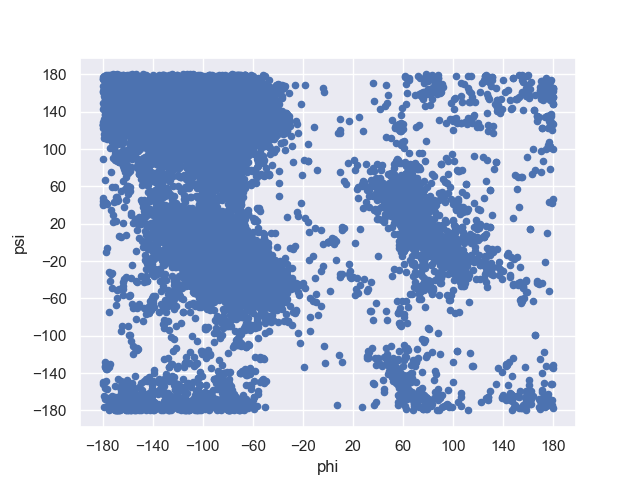
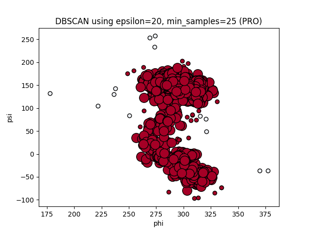
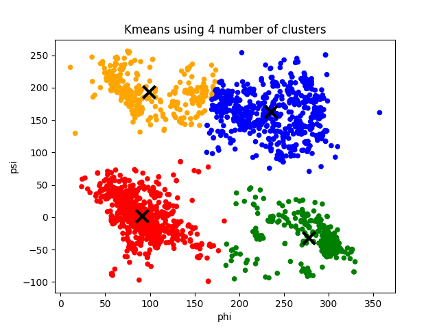

# Assignment 3: Clustering

## Tobias Lindroth: x hrs

## Robert Zetterlund: x hrs

---

## _Question 1_ - Show the distributions

These tasks are straightforward so we present the code rather than explain it.


### Scatterplot
```python
df.plot.scatter(x=PHI, y=PSI)
```

<p align="center">
    
    <p align="center">Figure 1: Scatterplot of psi and phi values <p>
<p>

### Heatmap

Code for creating square heatmap, show left below.

```python
# Square heatmap

# In this program we create a 18x18 matrix of integers, and calculate index by floor division

# create matrix
matrix = np.zeros((nr_boxes, nr_boxes), dtype=int)

# Calculate index by using
df = df.apply(lambda row: row // BOX_SIZE + INDEX_OFFSET )

# increment based on value
# increment values in matrix based on index
for row in df.itertuples(index=False):
    matrix[row[1]][row[0]] += 1

# create heatmap
ax = sns.heatmap(matrix, xticklabels=X_TICKS, yticklabels=Y_TICKS)
```

Code for creating smooth heatmap, shown right below:

```python
# smooth heatmap
sns.kdeplot(x=df[PHI], y=df[PSI], fill=True, cmap="rocket", cbar=True, thresh=0, levels=50)
```

<p align="center">
    
    
    <p align="center">Figure 2: Heatmap for dataset using two different representations<p>
<p>

## _Question 2_ -

<!--
Use the K-means clustering method to cluster the phi and psi angle combinations in the data file.
a. Experiment with different values of K. Suggest an appropriate value of K for this task and motivate this choice.
-->

By trying out different k-values we notice that k=3 or k=4 have the most reasonable clusters.

With a k < 3, the clusters does not explain the variation. For example, in `k = 2` both clusters range over all possible phi values and includes the interval `phi E (-30,20)` which has very few datapoints within it. Signalling that perhaps this divide should not be included in a cluster. For example, the blue centroid is seemingly the closest centroid for 4 different clusters.

With a k > 4 it seems like we are trying to create clusters where there should not be clusters, i.e we are overfitting.
For example, in `k = 5` the red and green clusters in the top left corner create an awkward split which looks artificial and wrong. We also see by comparing it to other plots that it has split the red centroid by creating two centroids instead in the top left corner.

<p align="center">

    
    
       
    <p align="center">Figure 3: The clusters created using k-means for different k. <p>
<p>

To decide whether k=3 or k=4 should be used we use an elbow curve as it can give an indication to what k-value fits the data best, that is, how many clusters we should use. In the figure below we can clearly see an elbow at k=3, hence the elbow curves indicates that 3 clusters is the best fit.

### Elbow curve

<p align="center">
    
    <p align="center">Figure 4: The elbow curve <p>
<p>

The calculation of the elbow curve was done by:

For each k (k=2 to k=10), taking the sum of the squared distances of samples to the nearest cluster centre. See the code snippet below.

```python
distorsions = []
for k in range(2, 10):
    kmeans = KMeans(n_clusters=k)
    kmeans.fit(X)
    distorsions.append(kmeans.inertia_)

#inertia is the sum of squared distances of samples to    their closest cluster center.
```

Since both our own experiment with different k-values and the elbow curved indicate k=3 to be a good value, we deem 3 to be the most suitable k-value for this task.

### Validation

<!-- b. Validate the clusters that are found with the chosen value of K. -->

We validate the clusters by checking if the clusters still are stable even if we remove a proportion of the points.

We remove a random 25% of the points and examine if the labeling remains similar. We choose 25% as we believe that is enough to have an affect on the clusters, but not change the dataset dramatically.

<p align="center" >
    
    
    <p align="center">Figure 5: The original clusters compared to the clusters created when removing a random 25% of the points. <p>
<p>

In the figures above we see that the shapes of the clusters almost do not change at all. There are minor changes but it is still the same clusters. This indicates that the clusters are stable.

We also notice that the colors of the clusters change in different runs. This does however not mean that the clusters are unstable since the initial centroids are different each time. Suppose that points nearest to “centre 1” are shown in blue, those nearest “centre 2” are shown in green and those nearest “centre 3” are shown in red. Which of the clusters we have found happens to be blue might change from one run to the next since the centres start off in different places and end up in different places, “centre 1” from one run might end up near to where “centre 2” ended up in another run.

So, we always find roughly the same clusters when performing k-means on different subsets of the dataset and hence we deem these clusters to be stable.s

<!--  Unsure whether color change indicates anything Den verkar göra det-->

### Do the clusters found seem reasonable?

<!--
c. Do the clusters found in part (a) seem reasonable?
-->

By looking at the figure below we notice that there are some aspects of the clustering that does not seem very reasonable. For example, the bottom left points, see label 1 in figure below, should probably not be in the blue set, but rather in the red. This is because psi=-180 is the same as psi=180 and hence the points in the bottom left should actually be in the red cluster as they are more connected to that cluster.

Furthermore, it seems unreasonable for the green cluster to be so scattered, see label 2 in figure below. It would probably be more reasonable if it was divided into two clusters. The points at the top and bottom in one cluster, and the points in the middle as another.

One could also argue that the points in the absolute bottom right corner, see label 3 in figure below (and possible some in the top right corner) should belong to the red set, as phi=-180 is the same as phi=180 (and again psi=-180 is the same as psi=180).

<p align="center">
    
    <p align="center">Figure 3: The clusters created using k-means for different k.  <p>
<p>

### Can you change the data to get better results?

<!--d. Can you change the data to get better results (or the same results in a simpler
way)? (Hint: since both phi and psi are periodic attributes, you can think of shifting/translating them by some value and then use the modulo operation.)
-->

By looking at the plots above, we notice two "divides", one at approximately `phi=0` and `psi=-110`. Below is a plot with added lines.

<p align="center">
    
    <p align="center">Figure: <p>
<p>

We reason that due to the periodic attributes we can show negative values as positive values by adding `360`, essentially shifting them. This would in practice revolve in the following result

|         |     | value  | shift? | new value |
| :-----: | :-: | :----: | :----: | :-------: |
| **phi** |     |  > 0   |   no   |    phi    |
| **phi** |     |  < 0   |  yes   |  phi+360  |
| **psi** |     | > -110 |   no   |    psi    |
| **psi** |     | < -110 |  yes   |  psi+360  |

```python
# shift phi by 180, new range is 0 >-> 360
# shift psi by 70, new range is -110 >-> 250
df[PHI] = df[PHI].apply(lambda phi: phi + 360 if phi < 0 else phi)
df[PSI] = df[PSI].apply(lambda psi: psi + 360 if psi < -110 else psi)
```

What happens to the elbow curve, should we select new value for k? Lets see by comparing the two elbows curve, the elbow curve to the right is the one with shifted values.

<p align="center">

    
<p>

We see that we improve the cumulative sum of the neighbors (the y axis) but that the optimal value for k remains, `k = 3`.

We plot the datapoints again using kmeans with shifted axises and get a visually more reasonable clusters that does not bridge any divides.

<p align="center">
    
    <p align="center">Figure: <p>
<p>

## _Question 3_

<!--
3. Use the DBSCAN method to cluster the phi and psi angle combinations in the data
file.
a. Motivate:
-->

## a - Motivate

<!--We will try to motivate our choice of the minimum number of samples and selecting the maximum distance by looking at heatmaps that we have generated. We will also look at a variant of the elbow-method to find an epsilon.-->

### i - the choice of the minimum number of samples in the neighbourhood for a point to be considered as a core point

_[To preface, we are not entirely sure how to motivate this number, we have googled quite a bit but with no luck]_

Things we had in mind when we chose the number:

- Do not form clusters of noise, hence we do not want to choose a to low minPts. Assisted by looking at our heatmaps.
- The value should be picked by someone with domain knowledge, i.e. not us.
- Given an arbitrarily chosen epsilon, we wanted to ensure that clusters we could visually motivate would be classified as such, and also that potential "bridges" across subsets of clusters.

Again, we did not really have any foundation when it came to this, we decided to test different values and ended up choosing 42. We decided that we would pick a suitable epsilon based on the value of minPts. It was noted online that this was an acceptable approach and we explore choosing this value more in depth in part d.

### ii - the choice of the maximum distance between two samples belonging to the same neighbourhood (“eps” or “epsilon”).

The following lines of code uses the algorithm explained in this [paper](https://iopscience.iop.org/article/10.1088/1755-1315/31/1/012012/pdf), via this [medium article](https://towardsdatascience.com/machine-learning-clustering-dbscan-determine-the-optimal-value-for-epsilon-eps-python-example-3100091cfbc), but **we changed** so that it takes the largest distance within in all k neighbours. If it takes the nearest it will get identical results for all `k>0`.

We found that this methodology worked well, and intuitively we motivate the adjustment in by the following statements:

- We want to have core points within clusters, given a sufficiently dense cluster and value of `k` it does not really matter if the value of epsilon increases.

- When the largest distance to the "k":th neighbor changest the most, it is possible that we encounter noise. So by picking the value of largest distance, we have made a distinction between noise and clusters that is reasonable.

- In contrary to the article (from medium) in which we found the algorithm, it performs differently based on the value of kmeans.

Here is how it is implemented:

```python
# init nearest neighbors with our dataset
neigh = NearestNeighbors(n_neighbors=n_neighbors)
nbrs = neigh.fit(X)

# get distances
(distances, _) = nbrs.kneighbors(X)

# Sort each node's distances to its closest n_neighbors neighbors
distances = np.sort(distances, axis=0)

# For each node, pick out the distance to the neighbor (out of closest n_neighbors) that is furthest away.
distances = distances[:, -1]

# find index of largest difference (make a distinction of 28750,
# since the plot looks exponental and we're only interested in "elbow" area.)
index = np.diff(distances[0:28750]).argmax()
```

Using `n_neighbors=42`, we get an epsilon of `19`, which we will use for the remainder of the analysis.

It is possible to argue our tweak to the algorithm, as this arbitrary distinction that noise begin at the largest jump in distance can have it's flaws. We also note that for large values of `n_neighbors` our approach performs poorly. But this proved effective for us and it seems that approaches are inherently data-dependent. We learn that it is important to have the amount of core points in mind and (although again, it is data dependent on the densisty) make sure that some non-core points are classified as well.

## b - Highlight clusters found using DBSCAN, Barplot and outliers.

<!--b. Highlight the clusters found using DBSCAN and any outliers in a scatter plot. How many outliers are found? Plot a bar chart to show which amino acid residue types are most frequently outliers.-->

### Scatterplot DBSCAN

Our code for creating a DBSCAN make use of masks.

```python
# create array same size as dataset, init as all false
core_samples_mask = np.zeros_like(db.labels_, dtype=bool)
# Take array and make boolean true for indices of core nodes
core_samples_mask[db.core_sample_indices_] = True
# ...
for u_label, color in zip(unique_labels, colors):
    # u_label is -1 if not part of cluster, ie. noise
    isNoise = u_label == -1

    # make unassigned datapoints grey
    if isNoise:
        color = "grey"
        noiseMask = (labels == u_label)

    # create mask for labels, used for selecting which datapoints to plot
    class_member_mask = (labels == u_label)
    # create mask for non core datapoints within current loop's members
    non_core = X[class_member_mask & ~core_samples_mask]
    # create mask for core datapoints within current loop's members
    core = X[class_member_mask & core_samples_mask]

    # do regular scatterplots ...
```

<p align="center">
     
    <p align="center">Figure: DBSCAN with epsilon=19, minPts=42<p>
<p>

### Barplot of noise

Using the same code as above, we use the `noisemask` and apply it to the dataframe. Then we count the occurence of each residue name and plot accordingly.

```python
# apply noisemask to dataframe
df_noise = df[noiseMask]
# count number of each name occuring in df, create column counts to store value
df_noise = df_noise
                   .groupby(['residue name'])
                   .size()
                   .reset_index(name='counts')

#create barplot
sns.barplot(x=df_noise["residue name"], y=df_noise["counts"])
```

<p align="center">
     
    <p align="center">Figure: Barplot of noise of above DBSCAN<p>
<p>

In total we have `327` noise points (outliers).

## c - Compare DBSCAN and K-means

When looking at the clusters found by K-means and those found using DBSCAN we find some similarities, but mostly differences.

The clusters are similar in the way that both methods found 3 clusters (This is however largely affected by our choice of parameters).

But even though they have the same amount of clusters, the clusters are very different. K-means splitted the points to the right into two clusters and kept the ones at the left as a single cluster while DBSCAN did the opposite. The clusters created by DBSCAN seems more reasonable those created by K-means. This is because when looking at the clusters, it is more clear that the points to the left should be divided into two clusters than that those to the right should be.

Furthermore we can see that the clusters created by DBSCAN are more compact clusters as it leaves outliers out of clusters. K-means at the other hand puts every node into clusters even though they sometimes clearly should not be in a cluster.

An interesting note is that if we had done the clustering by hand, we would probably have chosen a mixture between K-means and DBSCAN. That is, we would have divided both the points to the rigth and the ones to left into two clusters, in total four clusters.

<p align="center">
    
       
    <p align="center">Figure: The clusters created by k-means to the left and the clusters created by dbscan to the right.<p>
<p>

## d - Robust to small changes?

<!-- d. Discuss whether the clusters found using DBSCAN are robust to small changes
in the minimum number of samples in the neighbourhood for a point to be considered as a core point, and/or the choice of the maximum distance between two samples belonging to the same neighbourhood (“eps” or “epsilon”). -->

By looking at what happens when epsilon or minPts is changed by a small value, one notices that dbscan can be very sensitive to these parameters.

When changing one parameter at a time, we see that the clusters we have found are very sensitive to an increase in the maximum distance between two samples belonging to the same neighbourhood a little. The top left cluster is engulfed into the large cluster. This is because epsilon now is large enough for a "bridge" to be created by the top left cluster and the large cluster.

<p align="center">
    
      
      
       
    <p align="center">Figure: Top left (eps=17, minPts=42). Top Right (eps=21, minPts=42). Bottom left (eps=19, minPts=42). Bottom right (eps=19, minPts=44)<p>
<p>

When changing both parameters at the same time, we see the same thing. The top left cluster is engulfed into the large cluster when epsilon is increased.

The clusters are of course also effected by changes in minPts, but in our case it was an increase in epsilon that created a large difference. In another case it might be a change in minPts that changes the clusters fundamentally.

<p align="center">
    
      
      
       
    <p align="center">Figure: Top left (eps=17, minPts=40). Top Right (eps=17, minPts=44). Bottom left (eps=21, minPts=40). Bottom right (eps=21, minPts=44) <p>
<p>

The fact that DBSCAN is so sensitive to the minimum number of samples in the neighbourhood for a point to be considered as a core point, and/or the choice of the maximum distance between two samples belonging to the same neighbourhood, shows how important it is to choose these parameters carefully. A small increase or decrease can change the clusters fundamentally.

## _Question 4_

<!--
4. The data file can be stratified by amino acid residue type. Investigate how the clusters found for amino acid residues of type PRO differ from the general clusters. Similarly, investigate how the clusters found for amino acid residues of type GLY differ from the general clusters. Remember that parameters might have to be adjusted from those used in previous questions.
-->

### PRO

First we look at a scatterplot highlighting the amino acids with the PRO residue name.

<p align="center">
    
    <p align="center">Figure: <p>
<p>

We notice that amino acids with residue name PRO are can be classified into one or two clusters, since they are primarily in the phi range of 250 to 350, also they range somewhat consistently across phi -100 to 200. They are not evenly distributed through the entire dataset which lead us to believe that amino acids with residue name PRO are similar in characteristic and can be labeled with _somewhat_ precision.

Now for a more analytical analysis, we find suitable k using elbow curve and find that PRO has a `k = 3`.

<p align="center">
     
     
<p>
<!-- align="center">Elbow curve for residue type PRO, we find the largest inertia on k = 3, altough 6 is a value of interest -->

Comparatively little noise is noted when looking at the PRO dataset, verified by our DBSCAN below. We find that by using DBSCAN with reasonable chosen values of `epsilon` and `min_samples` provides one or two clusters.

<p align="center">
        
    
<p>

### GLY

First we look at a scatterplot highlighting the amino acids with the GLY residue name.

<p align="center">
    
    <p align="center">Figure: <p>
<p>

The scatterplot shows how the distribution of GLY-points is quite similar to the distribution of all points. This indicates that the clusters of GLY might be quite similar to the general clusters. The GLY-points are quite scattered,with a lot of noise, which indicates that amino acids with residue name GLY are not similar in characteristic and therefore can be difficult to label with precision.

In order to compare the clusters, we find suitable k using elbow curve and find that GLY has a `k = 4`.

<p align="center">
     
     
<p>

We find that by using DBSCAN with reasonable chosen values of `epsilon` and `min_samples` provides three or four clusters.

<p align="center">
      
      
<p>

In this case, we would argue that dbscan more accurately finds 3 clusters than kmeans did.
