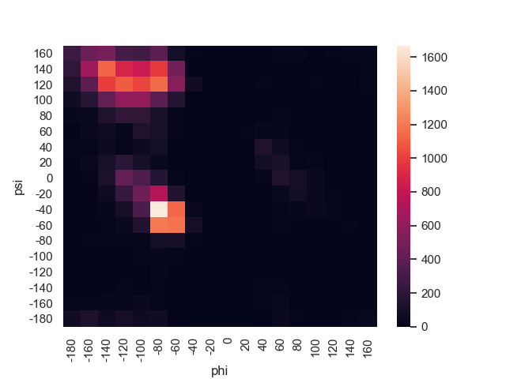

# Assignment 3: Clustering

## Tobias Lindroth: x hrs

## Robert Zetterlund: x hrs

---

## _Question 1_

<!-- 1. Show the distribution of phi and psi combinations using:
a. A scatter plot

b. A heat map
-->

### Scatterplot

    

### Heatmap

    
    

## _Question 2_

### Elbow curve

    

### KMeans plot

    
    

<!--
2. Use the K-means clustering method to cluster the phi and psi angle combinations in the data file.
a. Experiment with different values of K. Suggest an appropriate value of K for this task and motivate this choice.
b. Validate the clusters that are found with the chosen value of K.
c. Do the clusters found in part (a) seem reasonable?
d. Can you change the data to get better results (or the same results in a simpler
way)? (Hint: since both phi and psi are periodic attributes, you can think of shifting/translating them by some value and then use the modulo operation.)
-->

## _Question 3_

<!--
3. Use the DBSCAN method to cluster the phi and psi angle combinations in the data
file.
a. Motivate:
i. the choice of the minimum number of samples in the neighbourhood for a point to be considered as a core point, and
ii. the choice of the maximum distance between two samples belonging to the same neighbourhood (“eps” or “epsilon”).
b. Highlight the clusters found using DBSCAN and any outliers in a scatter plot. How many outliers are found? Plot a bar chart to show which amino acid residue types are most frequently outliers.
c. Compare the clusters found by DBSCAN with those found using K-means.
d. Discuss whether the clusters found using DBSCAN are robust to small changes
in the minimum number of samples in the neighbourhood for a point to be considered as a core point, and/or the choice of the maximum distance between two samples belonging to the same neighbourhood (“eps” or “epsilon”).
-->

## _Question 4_

<!--
4. The data file can be stratified by amino acid residue type. Investigate how the clusters found for amino acid residues of type PRO differ from the general clusters. Similarly, investigate how the clusters found for amino acid residues of type GLY differ from the general clusters. Remember that parameters might have to be adjusted from those used in previous questions.
-->
