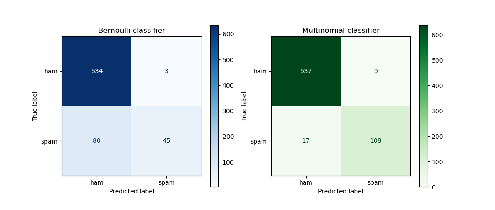
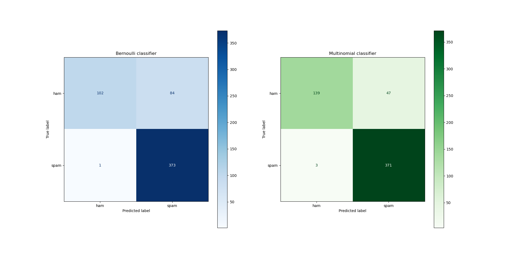
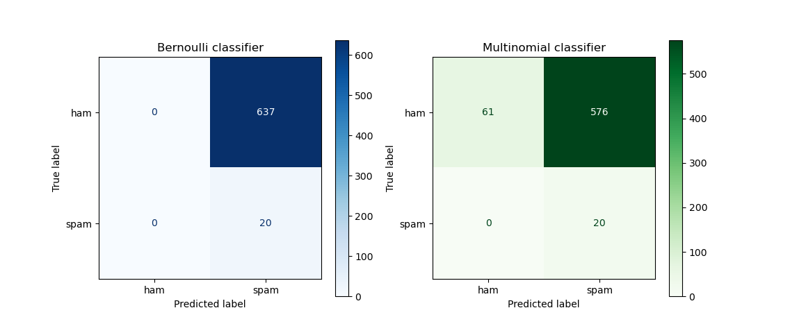

# Assignment 3: Spam classification using Naïve Bayes
 
## Tobias Lindroth: 15 hrs
 
## Robert Zetterlund: y hrs
 
## _Question 1_ - Preprocessing
 
## a
 
We read through some of the emails and find that some of them have date, receiver and sender in their header, and some emails have footers. We regard this as extra information.
 
<!--
a. Note that the email files contain a lot of extra information, besides the actual message.
Ignore that for now and run on the entire text. Further down (in the higher-grade part),
you will be asked to filter out the headers and footers.
-->
 
## b
 
<!--
b. We don’t want to train and test on the same data. Split the spam and the ham datasets
in a training set and a test set. -->
 
In order to split the datasets we create `split_files.py` which is runnable using arguments to specify which `folder` to copy from and which `percentage` of files that should be training.
 
```python
# get all filenames
all_files = glob.glob("../data/raw/" + folder + "/**")
 
# get splitindex
size = len(all_files)
splitIndex = int(size * (percentage / 100))
 
# create two list of filenames
test_files = all_files[:splitIndex]
train_files = all_files[splitIndex:]
 
# empty directory of test_path, then copy files to test_path.
emptyDir(test_path)
copyFilesToDir(test_files, test_path)
 
# empty directory of train_path, then copy files to train_path.
emptyDir(train_path)
copyFilesToDir(train_files, train_path)
 
```
 
Here are the helper functions:
 
```python
# helper function for refreshing directory
def emptyDir(path):
   if os.path.isdir(path):
       shutil.rmtree(path)
   os.mkdir(path)
 
# copy files to test folder
def copyFilesToDir(files, path):
   for file in files:
       shutil.copy(file, path)
```
 
## _Question 2_
 
<!--
Write a Python program that:
a. Uses four datasets (hamtrain, spamtrain, hamtest, and spamtest)
 
b. Using a Naïve Bayes classifier (e.g. Sklearn), classifies the test sets and reports the
percentage of ham and spam test sets that were classified correctly. You can use
CountVectorizer to transform the email texts into vectors. Please note that there are
different types of Naïve Bayes Classifier in SKlearn (Document is available here). Test two
of these classifiers: 1. Multinomial Naive Bayes and 2. Bernoulli Naive Bayes that are well
suited for this problem. For the case of Bernoulli Naive Bayes you should use the
parameter binarize to make the features binary. Discuss the differences between these
two classifiers.
-->
 
Here are some snippets of the code, this is the multinomial model but it is the same for the Bernoulli.
We chose `binarize=1` for bernoulli since we wanted words that occured atleast one time to be counted as present. 

```python
# Create classifier and fit for multinomial model.
clfMulti = MultinomialNB() # if bernoulli: use BernoulliNB instead
clfMulti.fit(counts, Y_train)
 
# Transforms each document into a vector (with length of vocabulary of train documents) with an
# integer count for the number of times each word appeared in the document
example_count = vectorizer.transform(X_test)

# Predict labels on the test data set
predictionsMulti = clfMulti.predict(example_count)
 
# helper function for getting percentage of correct predictions
def getPercentageCorrect(predictions):
   zippedTargetsPredictions = zip(Y_test, predictions)
   return sum(target == prediction for target, prediction in zippedTargetsPredictions) / len(predictions)*100
 
percentCorrectMulti = getPercentageCorrect(predictionsMulti)
```

### Differences between the classifiers
The **bernoulli** naive bayes classifier classifies emails based on words being absent or present. More generally, the bernoulli naive bayes classifier treats features as binary values.

The **multinomial** naive bayes classifier classifies emails based on the number of times words are present in an email. More generally, it uses the frequency of the features, not only if they are present or absent.

Let's take an example to show the difference. An email with the text "You have won money" would get the same classification by bernoulli as the email "You have won money money money money". That is since the feature "money" is present in both emails, it does not take into account that the feature has a higher frequency in one of the emails. The multinomial classifier, on the other hand, would take into account that the second email contains the word "money" four times.

This difference in how the classifiers work has effects on how well they perform. From the example above, it is quite reasonable to assume that the multinomial classifier works better then bernoulli when classifying longer texts since it takes repetitiveness into account. This might be what makes the multinomial more accurate when predicting the emails. 


## _Question 3_
 
<!--
Run your program on
i. Spam versus easy-ham
ii. Spam versus hard-ham
and include the results in your report.
-->
 
### Spam versus easy ham:
 
- **Multinomial**: Approximately `97.6 %` of the emails were classified correctly.
- **Bernoulli:** Approximately `89 %` of the emails were classified correctly.
 
The confusion matrices below shows that both classifiers were good at classifying ham correctly, but sometimes classified spam as ham. The bernoulli classifier had problems classifying spam as it classified more spam as ham than it classified spam as spam.
 
<p align="center">
   
   <p align="center">Figure 1: Confusion matrices showing how the different classifiers performed for easy-ham <p>
<p>
 
### Spam versus hard ham:
 
- **Multinomial**: Approximately `90.4 %` of the emails were classified correctly. The confusion matrix below shows that the classifier was quite accurate but classified both ham and spam wrong sometimes.
- **Bernoulli**: Approximately `81.8 %` of the emails were classified correctly. The confusion matrix below shows that the bernoulli classifier very accurately classified spam as spam, but sometimes classified ham as spam.
 
<p align="center">
   
   <p align="center">Figure 2: Confusion matrices showing how the different classifiers performed for easy-ham  <p>
<p>


### Implications
Earlier in the course we were discussing the idea of false positive and negatives. To recap, this means doing a faulty classification. What consequences does classifying a ham email have? When we discuss these topics we are not sure if it is desirable to be lenient and allow a large set of spam mail in your inbox in order to not incorrectly filter any ham mails. We come to the conclusion that although modern mail services (such as Outlook) employ spam-filtering, they also allow the user to see a folder named "spam", in which you can label mail as not spam or spam to help nudge the filtering. Therefore we think that it is okay to have results similar to the multinomial classifer for both easy and hard mails. This becomes more ambiguous when we look at the bernoulli classifier for hard mail, where the inbox only gets half of the ham mails.

Having said that, we could choose to judge the accuracy of our models using only how succesfully they classify ham to be ham. Or the opposite, accuracy of classifying spam to be spam. However, we think that the overall accuracy can be used to gauge the model's accuracy if and only if the distribution of ham and spam in the dataset is similar to how it is in the real world (we assume more spam are sent than ham in general). Then again, this depends on what types of lists your email address has leaked to.
 
## _Question 4_ - Filter on Common and uninformative words
 
## a - Why is it useful?
 
<!--
To avoid classification based on common and uninformative words it is common to filter
these out.
 
a. Argue why this may be useful. Try finding the words that are too common/uncommon
in the dataset.
 
-->
 
Common and uninformative words slow down the computational process and excluding them does not affect the results any noticable amount. Assume that the word "the", "of" and "and" show up in almost all emails, both spam and ham. Then it does not make sense to classify based on those. It is desirable to classify based on informative words. For example, in spam mails there might regularly be mention of money in the form of "cash" or using the \$-sign, when in ham we usually do not discuss money and when we do we rarely use the wording "cash".
 
We skim through the emails and find some common words:
 
- and
- the
- to
- what
- why
 
## b - Does the result differ?
 
<!-- b. Use the parameters in Sklearn’s CountVectorizer to filter out these words. Run the
updated program on your data and record how the results differ from 3. You have
two options to do this in Sklearn: either using the words found in part (a) or letting
Sklearn do it for you.
-->
 
There are different ways to handle the issue of uninformative words in sklearn. We will present three of which we found.
 
### Using the stop_words argument
 
Sklearn provides the argument `stop_words` which makes the countvectorizer filter out the uninformative words. It has some discussion regarding whether or not you should use the argument `"english"` since it might filter out informative words that happen to be common. We compare using no stop_words with using `english` as an argument.
 
```shell-session
python3 naive_bayes.py --stop_words english
```
 
| classifier \ stop_words | "english" |     | None    |
| ----------------------- | --------- | --- | ------- |
| **MultiNomial easy**    | 97.5065   | <   | 97.6377 |
| **MultiNomial hard**    | 91.4438   | >   | 90.3743 |
| **Bernoulli easy**      | 88.8451   | <   | 88.9763 |
| **Bernoulli hard**      | 83.9572   | >   | 81.8181 |
 
In both classifiers and difficulties there are barely any differences in accuracy. It is noted in the documentation that it could prove inefficient and instead the following method is recommended.
 
### Using the max_df and min_df
 
Instead of using the `stop_words`-argument they recommend tweaking `max_df` and `min_df`. Essentially, allows us to filter words based on the document frequency (df) of them. If they are in every file they have a `df=1`, if they are in none, they have a `df=0`. For simplicity, let us assume that it is calculated by:
 
```python
for document in documents:
   for unique_word in document:
       words[unique_word]++
 
df = words[word] / len(documents)
```
 
In the documentation they motivate not to use `stop_words="english"` and instead recommended to use `(min_df,max_df) = (0,0.7)`. We run
```
python3 naive_bayes.py --max_df 0.7
```
and we get the following results:
 
| classifier \ (min_df,max_df) | (0,0.7) |     | None    |
| ---------------------------- | ------- | --- | ------- |
| **MultiNomial easy**         | 98.5564 | >   | 97.6377 |
| **MultiNomial hard**         | 93.0481 | >   | 90.3743 |
| **Bernoulli easy**           | 88.7139 | <   | 88.9763 |
| **Bernoulli hard**           | 81.8181 | =   | 81.8181 |

It looks as if it can be useful picking `min_df` and `max_df` and we keep this in mind when we present an optimized model in the last section of this question.
 
### Using the token_pattern
 
We can also define what is allowed to be a token, this is done using regex and the default tokenization is
`r'(?u)\b\w\w+\b'` which is somewhat lax, allowing digits to be tokens. We write a more narrow tokenization only allowing tokens which contain 4 or more letters: `r'[a-z]{4,}'`.
 
| classifier \ (token_pattern) | r'[a-z]{4,}' |     | default |
| ---------------------------- | ------------ | --- | ------- |
| **MultiNomial easy**         | 97.1128      | <   | 97.6377 |
| **MultiNomial hard**         | 92.5133      | >   | 90.3743 |
| **Bernoulli easy**           | 87.5328      | <   | 88.9763 |
| **Bernoulli hard**           | 75.4010      | <   | 81.8181 |
 
Turns out our token_pattern overall does not improve the accuracy for our classifiers.
 
### Combining techniques
 
We try configuring the filtering of uninformative words and run the following command for easy ham:
 
```shell-session
python3 naive_bayes.py --token_pattern True --min_df 0.02 --max_df 0.98 --stop_words english --difficulty easy
```
 
The following command were ran for hard ham:
 
```shell-session
python3 naive_bayes.py --min_df 0.02 --max_df 0.98 --stop_words english --difficulty hard
```
 
| classifier \ (config) | custom  |     | default |
| --------------------- | ------- | --- | ------- |
| **MultiNomial easy**  | 98.5564 | >   | 97.6377 |
| **MultiNomial hard**  | 90.9090 | >   | 90.3743 |
| **Bernoulli easy**    | 97.5065 | >   | 88.9763 |
| **Bernoulli hard**    | 88.7700 | >   | 81.8181 |
 
We found that we improved both classification models using custom settings!
 
## _Question 5_
 
## A
 
We add a simple parser to attempt to remove the header from emails in our dataset by removing everything before the first occurence of the string "`Date:`". If the string is not available we skip any filtering. Implemented as below:
 
```python
if filterOn:
   content = content.split(filterOn, 1)[-1]
```
 
When running the program with the following command
```
python3 naive_bayes.py --filterOn Date:
```
 
we get the following result:
 
| classifier \ (filterOn) | Date:   |     | q3    |
| ----------------------- | ------- | --- | ------- |
| **MultiNomial easy**    | 96.8503 | <   | 97.6377 |
| **MultiNomial hard**    | 89.3048 | <   | 90.3743 |
| **Bernoulli easy**      | 88.9763 | =   | 88.9763 |
| **Bernoulli hard**      | 81.8181 | =   | 81.8181 |
 
 
When we add our filtering together with the parameters chosen in question 4, we get this command:
```
python3 naive_bayes.py --filterOn=Date: --min_df=0.02 --max_df=0.98
```
 
which yields the following result:
 
| classifier \ (filterOn) | Date:   |     | q4   |
| ----------------------- | ------- | --- | ------- |
| **MultiNomial easy**    | 95.8005 | <   | 98.5564 |
| **MultiNomial hard**    | 86.6310 | <   | 90.9090 |
| **Bernoulli easy**      | 91.2073 | <   | 97.5065 |
| **Bernoulli hard**      | 85.0267 | <   | 88.7700 |
 
This shows that removing the headers actually makes the model less accurate in most cases!
 
Since we are a bit unsure about how well our filtering works, and therefore if this result is to be trusted, we also implement a parser using the python `email` package. The code snippet below shows how the email package is used to get the body from an email.
 
```python
# Tries to remove the header and footer from the email
def getBodyFromEmail(mail):
   return getPayload(email.message_from_string(mail))
 
# Recursive function that fetches the payload from a Message object
# Returns a string
def getPayload(mail):
   if mail.is_multipart():
       return '\n'.join(list(map(lambda x: getPayload(x), mail.get_payload())))
   else:
       return mail.get_payload()
```
 
Using this parser we get the following result:
 
| classifier \ (filterOn) | email pkg |     | q3    |
| ----------------------- | --------- | --- | ------- |
| **MultiNomial easy**    | 95.9317   | <   | 97.6377 |
| **MultiNomial hard**    | 89.3048   | <   | 90.3743 |
| **Bernoulli easy**      | 88.8451   | <   | 88.9763 |
| **Bernoulli hard**      | 81.8181   | =   | 81.8181 |
 
 
When we add this filtering together with the parameters chosen in question 4, we get this command:
```
python3 naive_bayes.py --email_filtering=True --min_df=0.02 --max_df=0.98
```
 
which yields the following result:
 
| classifier \ (filterOn) | email pkg |     | q4   |
| ----------------------- | ------- | --- | ------- |
| **MultiNomial easy**    | 93.3071 | <   | 98.5564 |
| **MultiNomial hard**    | 85.0267 | <   | 90.9090 |
| **Bernoulli easy**      | 91.3386 | <   | 97.5065 |
| **Bernoulli hard**      | 83.9572 | <   | 88.7700 |
 
 
This again shows that it is not just the body of an email that has importance when classifying it as ham or spam, the header and footer also have features that can be important.
 
## B
 
If the training data set is unbalanced, that is, a majority of the data is of one class, the results will be skewed. That is because the model will almost only be exposed to one class and therefore is much more likely to place unseen data in the majority class as well.
 
Let's take the spam and ham emails as an example. If the training dataset almost only consists of ham emails, then the model will believe it is much more likely that the next email also is ham, just because there is so much more ham than spam emails. The prior, p(ham) will be close to 1. The prior p(spam) will be close to 0.
 
Furthermore, a lot of the words that are common in spam emails, but not ham, will most likely not be entered into the vocabulary since there are so few spam-emails in the training set. The model will miss a lot of the features of spam emails. This will make it more difficult for the model to classify spam as spam since words that are commonly used in spam emails may not even be in the vocabulary.
 
One way to fix this would be to truncate the majority class in the training dataset. That will, of course, mean a loss of information, but it will also lead to more equal datasets, and because of that, the model will probably be more accurate.
 
Another way to fix it could be to add more data to the minority class(es) in the training dataset. That, of course, means that you need to generate new data in some way or perhaps even duplicate data.
 
An additional idea is that you perhaps could add some weight to the data in the minority classes to make the model count minority classes more importantly.
 
## C
By applying the logic from question b, we believe a training set with mostly spam emails and a test set with mostly ham would lead to most messages in the test set to be classified as spam.
 
By removing all but 20 ham-emails from the easy-ham training data set while keeping all the spam and removing all but 20 spam-emails from the test set while keeping the ham, we get the following result:
 
**Multinomial**: Approximately `12.3288 %` were classified correctly.
 
**Bernoulli**: Approximately `3.0441 %` were classified correctly.
 
The model's accuracy decreased drastically. And by looking at the confusion matrices below we note that almost all emails are classified as spam.
 
<p align="center">
   
   <p align="center">Figure 3: Confusion matrices showing how the different classifiers performed with mostly spam in the training dataset and mostly ham in the test dataset.   <p>
<p>
 
<!--
Filter out the headers and the footers of the emails before you run on them. The format may
vary somewhat between emails, which can make this a bit tricky, so perfect filtering is not
required. Run your program again and answer the following questions:
 
a. Does the result improve from 3 and 4?
b. The split of the data set into a training set and a test set can lead to very skewed results.
Why is this, and do you have suggestions on remedies?
c. What do you expect would happen if your training set were mostly spam messages
while your test set were mostly ham messages?
-->
