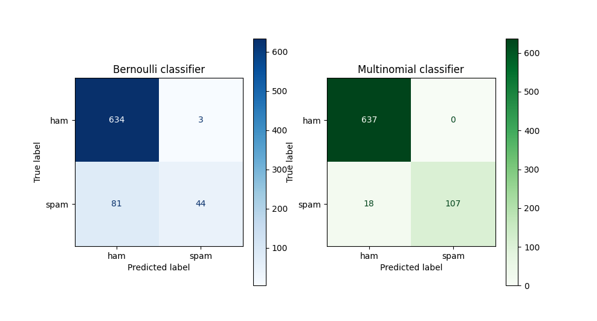
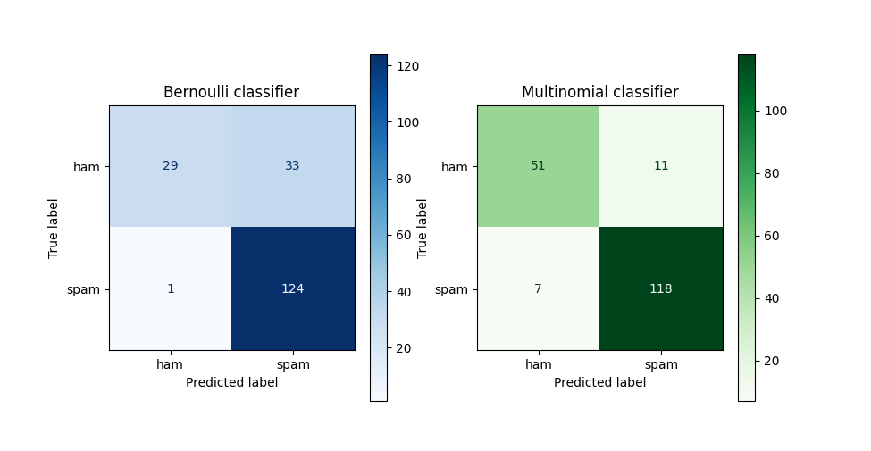

# Assignment 3: Spam classification using Naïve Bayes

## Tobias Lindroth: x hrs

## Robert Zetterlund: y hrs

## _Question 1_ - Preprocessing


## a
We read through some of the emails and find that some of them have date, reciever and sender in them. We regard this as extra information.
<!-- 
a. Note that the email files contain a lot of extra information, besides the actual message.
Ignore that for now and run on the entire text. Further down (in the higher-grade part),
you will be asked to filter out the headers and footers.
-->
## b
<!--
b. We don’t want to train and test on the same data. Split the spam and the ham datasets
in a training set and a test set. -->

In order to split the datasets we create `split_files.py` which is runnable using arguments to specify which `folder` to copy from and which `percentage` of files that should be training.

```python
# get all filenames
all_files = glob.glob("../data/raw/" + folder + "/**")

# get splitindex
size = len(all_files)
splitIndex = int(size * (percentage / 100))

# create two list of filenames
test_files = all_files[:splitIndex]
train_files = all_files[splitIndex:]

# empty directory of test_path, then copy files to test_path.
emptyDir(test_path)
copyFilesToDir(test_files, test_path)
```

Here are the helper functions:

```python
# helper function for refreshing directory
def emptyDir(path):
    if os.path.isdir(path):
        shutil.rmtree(path) 
    os.mkdir(path)

# copy files to test folder
def copyFilesToDir(files, path):
    for file in files:
        shutil.copy(file, path)
```


## _Question 2_ 


<!-- 
Write a Python program that: 
a. Uses four datasets (hamtrain, spamtrain, hamtest, and spamtest)

b. Using a Naïve Bayes classifier (e.g. Sklearn), classifies the test sets and reports the
percentage of ham and spam test sets that were classified correctly. You can use
CountVectorizer to transform the email texts into vectors. Please note that there are
different types of Naïve Bayes Classifier in SKlearn (Document is available here). Test two
of these classifiers: 1. Multinomial Naive Bayes and 2. Bernoulli Naive Bayes that are well
suited for this problem. For the case of Bernoulli Naive Bayes you should use the
parameter binarize to make the features binary. Discuss the differences between these
two classifiers. 
--> 
Here are some snippets of the code, this is the multinomial model but it is the same for the Bernoulli.

```python
# Create classifier and fit for multinomial model.
clfMulti = MultinomialNB() # if bernoulli: use BernoulliNB instead
clfMulti.fit(counts, Y_train)

example_count = vectorizer.transform(X_test)
predictionsMulti = clfMulti.predict(example_count)

def getPercentageCorrect(predictions):
    zippedTargetsPredictions = zip(Y_test, predictions)
    return sum(target == prediction for target, prediction in zippedTargetsPredictions) / len(predictions)*100

percentCorrectMulti = getPercentageCorrect(predictionsMulti)
```


The **bernoulli** naive bayes classifier classifies emails based on words being absent or present. More general, it treats features as binary values. 

The **multinomial** naive bayes classifier classifies emails based on the amount of times words are present in a email. More general, it uses the frequency of the features to classify. 

Let's take an example to show the difference. An email with the text "You have won money" would get the same classification by bernoulli as the email "You have won money money money money". That is since the feature "money" is present in both emails, it does not take into account that the feature has a higher frequency in one of the emails. The multinomial classifier, on the other hand, would take into account that the second email contains the word "money" four times. 

## _Question 3_ 
<!--
Run your program on
i. Spam versus easy-ham
ii. Spam versus hard-ham
and include the results in your report. 
 -->

Spam versus easy ham:
- **Multinomial**: Approximatly `97.8 %` of the emails were classified correctly. 
- **Bernoulli:** Approximatly `89.1 %` of the emails were classified correctly.

The confusion matrices below shows that both classifiers were good at classifying ham correctly, but sometimes classified spam as ham. Especially the bernoulli classified had problems classifying spam as it classified more spam as ham than itclassified spam as spam. 

<p align="center">
    
    <p align="center">Figure 1: Confusion matrices showing how the different classifiers performed for easy-ham <p>
<p>

Spam versus hard ham:
- **Multinomial**: Approximately `90.9 %` of the emails were classified correctly. The confusion matrix below shows that the classifier were quite accurate but classified both ham and spam wrong sometimes. 
- **Bernoulli**: Approxiamtely `82.4 %` of the emails were classified correctly. The confusion matrix below shows that the bernoulli classifier very accurately classified spam as spam, but sometimes classified ham as spam. 

<p align="center">
    
    <p align="center">Figure 2: Confusion matrices showing how the different classifiers performed for easy-ham  <p>
<p>


## _Question 4_ - Filter on Common and uninformative words


## a - Why is it useful? 


## b - Does the result differ?

There are different ways to handle the issue of uninformative words in sklearn. We will present two of which we found.

### Using the stop_words argument

Sklearn provides the argument `stop_words` which makes the countvectorizer filter out the uninformative words. It has some discussion regarding whether or not you should use the argument `"English"` since it might filter out informative words that happen to be common.

### Using the max_df and min_df
instead they reccomend using max df 0.7

### Using the token_pattern

we can also define what is allowed to be a token, we do not want digits to be tokens.
maybe include $ aswell... ?

<!--
To avoid classification based on common and uninformative words it is common to filter
these out. 

a. Argue why this may be useful. Try finding the words that are too common/uncommon
in the dataset.
b. Use the parameters in Sklearn’s CountVectorizer to filter out these words. Run the
updated program on your data and record how the results differ from 3. You have
two options to do this in Sklearn: either using the words found in part (a) or letting
Sklearn do it for you. 
-->

## _Question 5_
## A
When adding our parser to the program from question 4, which removes all text above the first instance of `"date:"`, we get the following result:

Spam versus easy ham:
- **Multinomial**: Approximatly `97.8 %` of the emails were classified correctly. Almost the same as question 3.
- **Bernoulli:** Approximatly `95.1 %` of the emails were classified correctly. Better than question 3.

Spam versus hard ham:
- **Multinomial**: Approximatly `87.2 %` of the emails were classified correctly. Worse than question 3.
- **Bernoulli:** Approximatly `86.6 %` of the emails were classified correctly. Better than question 3.

This shows that removing the headers actually makes the model less accurate!


Since we are a bit unsure about how well our filtering works, and therefore if this result is to be trusted, we also implement a parser using the python `email` package. The code snippet below shows how the email packages is used to get the body from an email.

```python
# Tries to remove the header and footer from the email
def getBodyFromEmail(mail):
    return getPayload(email.message_from_string(mail))

# Recursive function that fetches the payload from a Message object
# Returns a string
def getPayload(mail):
    if mail.is_multipart():
        return '\n'.join(list(map(lambda x: getPayload(x), mail.get_payload())))
    else:
        return mail.get_payload()
```

Using this parser, we get the following result:

Spam versus easy ham:
- **Multinomial**: Approximatly `91.7 %` of the emails were classified correctly. Worse than question 3. 
- **Bernoulli:** Approximatly `91.6 %` of the emails were classified correctly. Better than question 3.

Spam versus hard ham:
- **Multinomial**: Approximatly `84.0 %` of the emails were classified correctly. Worse than question 3. 
- **Bernoulli:** Approximatly `82.4 %` of the emails were classified correctly. The same as question 3. 


This again shows that it is not just the body of an email that has importance when classifying it as ham or spam, the header and footer also have features that can be important.

## B
If the training data set is unbalanced, that is, a majority of the data is of one class, the results will be skewed. That is because the model will almost only be exposed to one class and therefore is much more likely to place unseen data in the majority class as well. 

Let's take the spam and ham emails as an example. If the training dataset almost only consists of ham emails, then the model will believe it is much more likely that the next email also is ham, just because there are som much more ham than spam emails. The prior, p(ham) will be close to 1.  The prior p(spam) will be close to 0.

Furthermore, a lot of the words that are common in spam emails, but not ham, will most likely not be entered into the vocabulary since there are so few spam-emails in the training set. The model will miss a lot of the features of spam emails. This will make it more difficult for the model to classify spam as spam since words that are commonly used in spam emails may not even be in the vocabulary.

One way to fix this would be to truncate the majority class in the training dataset. That will, of course, mean a loss of information, but it will also lead to more equal datasets, and because of that, the model will probably be more accurate. 

Another way to fix it could be to add more data to the minority class(es) in the training dataset. That, of course, means that you need to generate new data in some way or perhaps even duplicate data. 

An additional idea is that you perhaps could add some weight to the data in the minority classes to make the model count minority classes more importantly. 

## c
By applying the logic from question b, we belive a training set with mostly spam emails would lead to many ham messages in the test set to be classified as spam. 

By removing all but 10 ham-emails from the easy-ham training data set, while keeping all the spam, we get the following result:

**Multinomial**: Approximatly `22.3 %` were classified correctly.

**Bernoulli**: Approxiamtely `16.4 %` were classified correctly.

The models accuracy decreased drastically. And by looking at the confusion matrices below we note that almost all emails are classified as spam. 

<p align="center">
    
    <p align="center">Figure 3: Confusion matrices showing how the different classifiers performed when there were only 10 ham-emails.   <p>
<p>

<!-- 
Filter out the headers and the footers of the emails before you run on them. The format may
vary somewhat between emails, which can make this a bit tricky, so perfect filtering is not
required. Run your program again and answer the following questions: 

a. Does the result improve from 3 and 4?
b. The split of the data set into a training set and a test set can lead to very skewed results.
Why is this, and do you have suggestions on remedies?
c. What do you expect would happen if your training set were mostly spam messages
while your test set were mostly ham messages? 
-->