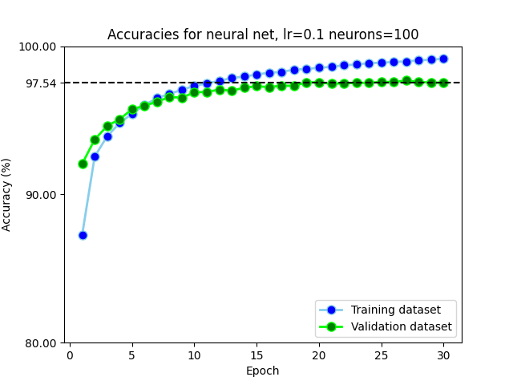
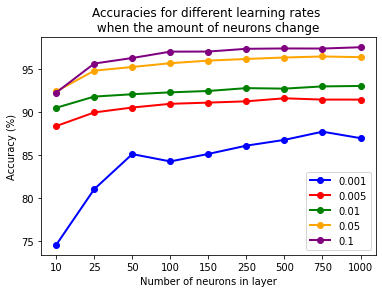
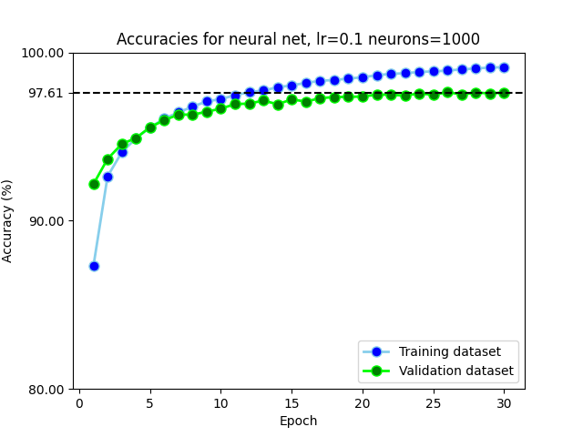

# Assignment 7

### Tobias Lindroth: 17 hrs

### Robert Zetterlund: 16 hrs

## _Question 1_

### _A)_

The layers are created in this sequence of code

```python
model.add(Flatten())
model.add(Dense(125, activation = 'relu'))
model.add(Dense(100, activation = 'relu'))
model.add(Dense(50, activation = 'relu'))
model.add(Dense(num_classes, activation='softmax'))

```

Which results in

- 1 input layer
- 3 hidden layers
- 1 output layer

In total: **`5`** layers.

Where

- Input layer has 28\*28=`784` neurons
- Hidden layer 1 has `125` neurons
- Hidden layer 2 has `100` neurons
- Hidden layer 3 has `50` neurons
- Output layer has `10` neurons

The parameters in the network are weights and biases.

The total number of weights (the number of connections between the neurons), are:

```
784*125 + 125*100 + 100*50 + 50*10 = 116000
```

The total number of biases (the number of nodes) are:

```
125 + 100 + 50 + 10 = 285
```

In total, the network has 116000+285 = 116285 parameters.

We can verify this by using the `summary()`-method that is available for keras-models.

```python
print(model.summary())

Model: "sequential"
_________________________________________________________________
Layer (type)                 Output Shape              Param #
=================================================================
flatten (Flatten)            (None, 784)               0
_________________________________________________________________
dense (Dense)                (None, 125)               98125
_________________________________________________________________
dense_1 (Dense)              (None, 100)               12600
_________________________________________________________________
dense_2 (Dense)              (None, 50)                5050
_________________________________________________________________
dense_3 (Dense)              (None, 10)                510
=================================================================
Total params: 116,285
Trainable params: 116,285
Non-trainable params: 0
```

### B)

```python
# get fit_info when training model
fit_info = model.fit(...)

# Plot training-accuracy
plt.plot( list(range(1,epochs+1)), [a*100 for a in fit_info.history['accuracy']], marker='o', markerfacecolor='blue', markersize=8, color='skyblue', linewidth=2)
# Plot validation-accuracy.
plt.plot( list(range(1,epochs+1)), [a*100 for a in fit_info.history['val_accuracy']], marker='o', color='lime', markerfacecolor='green', markersize=8, linewidth=2)
```

<p align=center>

<p>

We get that the accuracy on the test dataset is approximately `97.46 %` for this network when using 10 epochs and a learning rate of 0.1.


## _Question 2_

###  A)

Similar as before, the learning rate is set to 0.1, and the layers of the model is:

```python  
train_model(
    #...
    [
     Flatten(),
     Dense(100, activation='relu'),
     Dense(10, activation='softmax')
    ],
    epochs=30,
    lr=0.1
)
```

<p align=center>

<p>

Using this network, we get that the accuracy on the validation dataset after training with 30 epochs is approximately `97.54 %`.

### B)

To find the optimal learning rate, that is, the learning rate that yields the best accuarcy, we try some learning rates in the interval between 0.001 and 1.0.

```python
learningrates = [0.001, 0.005, 0.025, 0.05, 0.1, 0.25, 0.5, 1]

for learningRate in learningrates:
    for j in range(3):
        # train model with 10 epochs, store accuracy, learning rate
        train_model(...,lr=learningRate, epochs=10)

        accuracy += model.evaluate(x_test, y_test, verbose=0)[1]

    #calculate accuracy average
    accuracy /= 3
    # Add learning rate and the average accuracy to the list
    accuracies.append((learningRate,accuracy))

# get highest avg
bestAccuracy = max(accuracies, key=lambda item:item[1])
```

The results show that the optimal learning rate is approximately 0.5, which yields an accuracy of 97.8 %.

### C)

Similar as to above, we introduce an additional for-loop over neurons.

```python
neuronsToTry = [10, 25, 50, 100, 150, 250, 500, 750, 1000]
learningRatesToTry = [0.001, 0.005, 0.01, 0.05, 0.1]

for neurons in neuronsToTry:
    for lr in learningRatesToTry:
        # train model with values of neurons and learning rate
        model, fit_info = train_model(
            #...
            ,[
                Flatten(),
                Dense(neurons, activation='relu'),
                Dense(10, activation='softmax')
            ],
            epochs=10,
            lr=lr
         )
         # Evaluate model and store information in dataframe
         # ...

# line plot each learning rate:
for idx,lr in enumerate(learningRatesToTry):
    ## filter out learning rates for plot
    lr_df = df[df["learning rate"]==lr]
    ## used for equal spacing of x axis
    lr_df["x"] = [neuron for neuron in range(len(neuronsToTry))]
    ## plot line
    lr_df.plot.line(x="x", y="accuracy", color=colors[idx], legend=True, marker='o', linewidth=2, ax=ax)
```

<p align=center>

<p>

It appears that having more than 250 neurons seems redudant and that a learning rate of 0.1 is the best for all amounts of neurons.

Overall, the model that performs the best is the one with `1000` neurons and a learning rate of `0.1`, with an accuracy of `97.5%` on the validation set.

To show the optimal model we use the same code used in question 2 but with changed neurons and learning rate, shown below. 

```python
neurons_in_layer = 1000
learning_rate = 0.1
epochs = 30
```

<p align=center>

<p>

## _Question 3_

### A)

We add the gaussian noise layer as the first hidden layer, see code snippet below.

```python
[
    Flatten(),
    GaussianNoise(<standardDeviation>),
    Dense(100, activation='relu'),
    Dense(num_classes, activation='softmax'),
]
```

We use simple for loop and iterate over suggested standardDeviations.

```python
for standardDeviation in [0.1,1,10]:
    # train and evaluate model...
```

We calculate the different predictions score using the different standard deviations.

- `0.1` yields a test accuracy of 97.85 %
- `1` yields a test accuracy of 95.77 %
- `10` yields a test accuracy of 9.74 % 

**Can you come up with an argument for why adding noise like this could be a good idea in certain situations?**

When reading [Keras' documentation](https://keras.io/api/layers/regularization_layers/gaussian_noise/), we realize that what the noise layer essentially does is that it adds random noise to each input before handing the inputs to the next layer. 

By adding the noise layer as the first hidden layer we can make each input look a little bit different every time it is given to the network. Logically, it follows that this will decrease the risk of the network fitting individual points exactly. Hence, by adding random noise, we reduce overfitting. 

Reducing overfitting is important as it helps the model to be more generalized and work better on new, unseen data. If you for example have a small dataset, the model might not be very generalized as it likely will have been able to fit the data points in the training data set precisely. In such a case, adding noise could be a good idea as it will reduce overfitting.  


<!--- The reason we put Gaussian noise as the first hidden layer is because of the consensus within the community. 

According to [Jason Brownlee PhD](https://machinelearningmastery.com/train-neural-networks-with-noise-to-reduce-overfitting/), Gaussian noise can be useful to reduce overfitting. [to be continued] 
-->

### B)

We add l_2 regularization to the hidden layer, see code snippet below.

```python
[
    Flatten(),
    Dense(100, activation='relu', kernel_regularizer=l2(regParam)),
    Dense(num_classes, activation='softmax')
]
```

We use a simple for loop and iterate over some regularization parameters in the intervall [0.001, 01].

```python
for regParam in [0.001, 0.005, 0.01, 0.05, 0.1]:
    #train and evaluate model...
```
We get the following result: 

| reg param | Test loss | Test accuracy |
| --------- | --------- | ------------- |
| 0.001     | 0.12269   | 0.9768        |
| 0.005     | 0.18344   | 0.9671        |
| 0.01      | 0.24128   | 0.9552        |
| 0.05      | 0.48544   | 0.8988        |
| 0.1       | 0.98786   | 0.7328        |

In [question 2a](#question-2) we got a test accuracy of **`0.9754`** when using the same network, the same learning rate, and the same number of epochs, but without l_2 norm regularization. 

Hence it seems like adding l_2 regularization to our layer does **`not`** significantly improve the final prediction score, as we receive very similar results for all different simulations of the same model. We are not sure on why l_2 does not improve, but we can speculate.

Regularization is often used to reduce overfitting so that the model will work better on new, unseen data, and not only on the training data. The fact that regularization does only improve our network very slightly indicates that our network is not overfitting. 


<!--Reg param: 0.001 Test loss: 0.12269703298807144, Test accuracy 0.9768000245094299
Reg param: 0.005 Test loss: 0.1834477186203003, Test accuracy 0.9671000242233276
Reg param: 0.01 Test loss: 0.2412899136543274, Test accuracy 0.955299973487854
Reg param: 0.05 Test loss: 0.4854423701763153, Test accuracy 0.8988000154495239
Reg param: 0.1 Test loss: 0.9878652095794678, Test accuracy 0.7328000068664551
-->

## _Question 4_

### A)

<!--
Use at least one convolutional layer and try and create a network that can reach 99% accuracy on the validation data. If you choose to use any layers except convolutional layers and layers that you used in previous exercises, you must describe what they do. If you do not reach 99% accuracy, report your best performance and explain your attempts and thought process.
 -->

We create the following architecture for this assignment:

```python
 [
    GaussianNoise(0.1),
    Conv2D(45, (5,5), activation="relu", input_shape=input_shape, kernel_regularizer=l2(0.001)),
    MaxPooling2D(2,2),
    Conv2D(60,(5,5), activation="relu", input_shape=input_shape),
    MaxPooling2D(2,2),
    Flatten(),
    Dense(num_classes, activation='softmax')
]
```
We achieve a validation accuracy of `99.1%`. The new type of layers that we introduce are convulutional layers (`Conv2D`) and max pooling layers (`MaxPooling2D`). 

`Conv2D` works by introducing the concept of features within the image. It aims to solve the issue that fully connected layers have trouble with, *the spatial structure of images*. Essentially, by examining (in our case) multiple 5x5 sections of the image, it is possible to determine the presence of certain features *appearing* or not.  If we were to search for edges, it could be beneficial to search for vertical lines. Then we would examine multiple 5x5 sections of the image with a *feature map* primed to detect said edges. Conceptually this is how we would want it to work, but the model changes feature maps to optimize itself and the conceptual approach might not suit the model.

`MaxPooling2D` is a layer that paired with convolutional layers highlight the features detected in a summarized way. By applying pooling over the previous layer, the previous layer can be condensed. Max pooling (with stride=1) condenses every 2x2 matrix in the previous layer to a single node by selecting the maximum value, reducing the size by a factor of 2. Pooling are useful for detecting small changes of feature activation in the convolutional layer.  

### B)

<!--
What is a benefit of using convolutional layers over fully connected ones?
--->

One benefit of convolutional networks compared to fully connected ones is that they still can recognize an image even though the image has been slightly shifted. In the context of recognizing digits, the convolutional should be able to recognize a digit even though the digits are placed a bit different in the image (e.g. slightly to the left or to the right, see figures below) compared to the images in the training dataset.

<p align="center">
      
    <br>
    
    <p align="center">Shifting the digit slightly to the right.<p>  
<p>

We implement this type of shifting using `np.roll` in the code section below. 

```python
def roll(data, direction, steps):
    #rigth
    if direction == 1:
        return np.roll(data,steps,axis=1)  
    #left    
    elif direction == 2:
        return np.roll(data,-1*steps,axis=1)
    # UP
    elif direction == 3:
        return np.roll(data, -1*steps,axis = 0)
    # Down    
    elif direction == 4:
        return np.roll(data,steps,axis = 0)
```

When shifting all the images in the validation dataset 3 pixels to the right, we indeed get that the convolutional network from question 4a performs much better than the fully connected network from question 2a. 

- Convolutional network: 90.1 % accuracy
- Fully connected network 57.1 % accuracy

Another benefit of using convolutional networks is that it will need fewer parameters than a fully connected one. This makes it more efficient when it comes to memory and complexity. The reason why it needs fewer parameters is that it uses shared weights and biases. Each of the hidden neurons in a feature map will have the same array of weights and the same bias. This means that a convolutional layer with 3 feature maps and windows of 5\*5 neurons will have only 3\*5\*5 + 3=78 parameters. 


