# Assignment 8

### Tobias Lindroth: 11 hrs

### Robert Zetterlund: 11 hrs

# Question 1:

_[The branching factor ‘d’ of a directed graph is the maximum number of children (outer degree) of a node in the graph. Suppose that the shortest path between the initial state and a goal is of length ‘r’. ]_

### a)

_[What is the maximum number of BFS iterations required to reach the solution in terms of ‘d’ and ‘r’?]_

We assume that the length 'r' is the amount of edges in a path. The amount of edges in a path is one less than the amount of nodes in a path.

For simplicity let us assume `d=2` and that goal is the lower right corner node.

```
                o           ^
            o       o       | in total 3 splits (r)
          o   o   o   o     | path is 4 nodes (r+1) 
         o o o o o o o o    v
```

In this case then when `d=2` and `r=3` we can express the maximum number of bfs iterations as `sum of d^i, where i = 1,...,r-1. = 7`.

So, in general, the maximum number of BFS iterations to reach a solution can be calculated simply as `"the total number of nodes" - 1`.

In terms of `d` and `r` this can be written as:

<p align="center">
    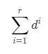
<p>


### b)

_[Suppose that storing each node requires one unit of memory and the search algorithm stores each entire path as a string of nodes. Hence, storing a path with k nodes requires k units of memory. What is the maximum amount of memory required for BFS in terms of ‘d’ and ‘r’ ?]_

The total amount of stored paths depend on the current layer (how long a path is) and how many nodes are at the current level (how many unique paths we have).

For every iteration, `d` new paths arise. If `d=3`, the first split 1 path becomes 3, at second split 3 paths become 5, then 7, then 9. This is equal to the nodes of the layer. All these nodes have equal length to the initial node. We can then simply multiply depth times width to calculate the memory cost.

To calculate the width of the tree we find the amount of nodes at the layer that the goal is on. Say `d=3` and `r=3`, then the total amount of nodes will be 40, and the width will be `3^3=27`. Since the height is 3, 4 nodes are required to build each path. The total memory required is then 27 \* 4 = 108.

So, in general, the maximum amount of memory can be calculated as:

```
(width of tree) * (height of tree + 1)
```

In terms of `d` and `r` this can be written as:


<p align="center">
    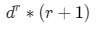
<p>

# Question 2

## Find all labeling of these three nodes, where DFS will never reach to the goal! Discuss how DFS should be modified to avoid this situation?

<p align="center">
    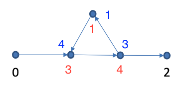
<p>

What is important here is to always make the rightmost point in the triangle choose "incorrectly", meaning it should choose to remain in the loop. This means that the "1" must always be placed at the top of the triangle. 3 and 4 can be placed however deemed fit as the arrows indicate which directions that are allowed.

To solve this issue you can use: "Iterative Deepening DFS". That is, we limit the depth of any one path to make sure we do not end up in a loop in the graph.

In our example, we can by using this change, prevent the algorithm to continue in the loop, and instead make sure it visits the end node. The figures below are an example of how the iterative DFS will work if the labels are chosen to

<pre>
  1
 / \
3 - 4
</pre>

Depth level 0. Only the first node is visited.

<p>
    
<p>


Depth level 1. We reach the second element before reaching the limit.

<!--- NExt iteration --->
<p>
    
<p>


Depth level 2

<!--- NExt iteration --->
<p>
    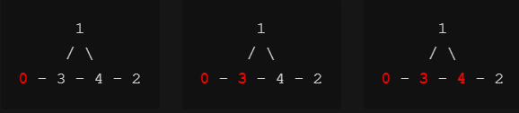
<p>

Depth Level 3. After reaching the node with value `1` we can not continue deeper because of the limit. Instead we visit the node that is left at depth 3, the end node.

<!--- NExt iteration --->

<p>
    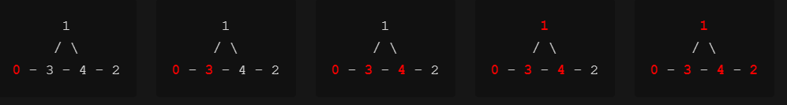
<p>

# Question 3:

[(a) _Suppose that the goal is to cover the topics [welcome,skiing,robots] and the algorithm always selects the leftmost topic to find the neighbors for each node. Draw (by hand) the search space as a tree expanded for a lowest-cost-first search until the first solution is found. This should show all nodes expanded, which node is a goal node, and the frontier when the goal was found._]

Below is the search space until the first solution for a lowest-cost-first search. The nodes are written as {To_Cover, Segs} and the node marked with `Solution!` is the found goal node.

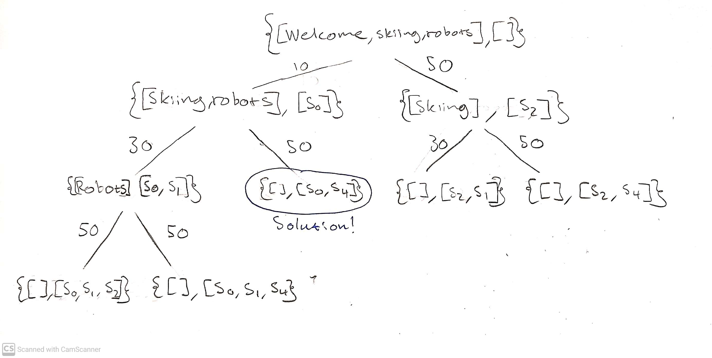

[(b) _Give a non-trivial heuristic function h that is admissible. [h(n)=0 for all n is the trivial heuristic function.]_]

Our idea is to create a heuristic function that given a node returns an estimate of how many seconds it will take to complete the topics in `To_Cover`. That is, given e.g. {[Skiing, robots], []} our heuristic function should estimate the length it will take to cover the topics skiing and robots.

However, we know from the lecture that an admissible heuristic function never should overestimate the actual cost.

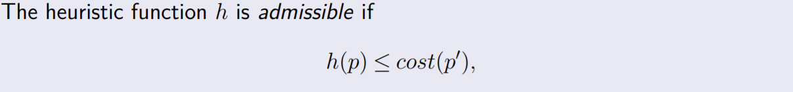

Hence, our heuristic function should calculate the lowest possible time it will take to cover the topics in `To_Cover`. This will make sure that we never overestimate the actual cost. Note the similarity between this and using the straight-line distance in the shortest-path problem.

The lowest possible time to cover a topic? Well, that is simply the minimum value of `length / number of topics covered` for all the rows in the database. In our problem, the lowest possible time it will take to cover a topic is **`10 seconds`**.

Hence our heuristic function will simply be

```
Number of topics in To_cover * 10
```

# Question 4

[*Consider the problem of finding a path in the grid shown below from the position s to the position g. A piece can move on the grid horizontally or vertically, one square at a time. No step may be made into a forbidden shaded area. Each square is denoted by the xy coordinate. For example, s is 43 and g is 36. Consider the Manhattan distance as the heuristic.*]

[(a) *Write the paths stored and selected in the first five iterations of the A* algorithm, assuming that in the case of tie the algorithm prefers the path stored first.*]

<p align="center">
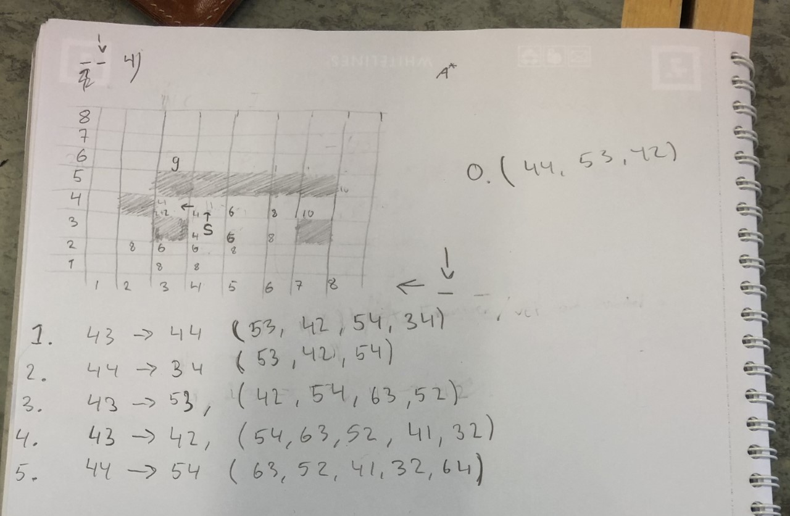
<p>

Here are table representations of the first five iterations of the A\* algorithm. Within the `possible steps`-column, the \*\*xx\*\* indicates the selected next node based on the lowest `h(x)` or order of stored (starting north going clockwise).

```
iter    step         possible steps             cost

0.       43          (*44*,53,42)               (4,6,6)
1.    43 -> 44       (53,42,54,*34*)            (6,6,6,4)
2.    44 -> 34       (*53*,42,54)               (6,6,6)
3.    43 -> 53       (*42*,54,63,52)            (6,6,8,8)
4.    43 -> 42       (*54*,63,52,41,32)         (6,8,8,8,6)
5.    44 -> 54       (63,52,41,*32*,64)         (8,8,8,6,8)
```

The stored paths are as follows:

```
iter                         stored paths                       step

0.    {(43)}                                                    select 43
1.    {(43),(43,44)}                                            43 -> 44
2.    {(43),(43,44),(43,44,34)}                                 44 -> 34
3.    {(43),(43,44),(43,44,34),(43,53)}                         43 -> 53
4.    {(43),(43,44),(43,44,34),(43,53),(43,42)}                 43 -> 42
5.    {(43),(43,44),(43,44,34),(43,53),(43,42),(43,44,54)}      44 -> 54


```

[*(b) Solve with software, Use Manhattan distance, no diagonal step and compare A\*, BFS and Best-First- Search. Write a short description about your observation. How does each of these methods reach the solution? Why? Which one is faster?*]

Below is a table with numbers exctracted when running the problem.

| q4-b                | **A\*** | **Best First-search** | Breadth First-search |
| ------------------- | :-----: | :-------------------: | :------------------: |
| **# of operations** |   57    |          39           |        284           |
| **length**          |    9    |          9            |         9            |

### A\*

A-star knows where the goal is and tries to find a path to it. It uses manhattan distance to "rate" every state based on how it got there as well as how long it is via "manhattan"-distance to the goal.

A\* reaches the solution by adding all discovered new nodes to a priority queue. The priority queue is sorted based on the sum `f(x)` of:

1. The shortest path to that node, `g(x)`
2. The heuristic for that node, `h(x)`, in our case the manhattan distance.

When we have equal values in our priority queue the decision can be made either to prioritize the node found first, or prioritize the lowest `h(x)` by convention.

A\* is effective in the sense that if we have found the beginning of an optimal path it is likely to continue along that path, as the value of `h(x)` get smaller. As `h(x)` gets smaller `g(x)` gets bigger, but if the direction is directly towards the goal, `f(x)` remains the same. Thus the path continues to be explored as `f(x)` is still first in the queue.

Regarding the problem in the software, the goal is reached after `71` operations. This is because it "incorrectly" explores the corner to the top left of the start. We went more in depth into how in the iteration example above, but in short: since A\* is unaware of walls it will attempt straight-line approaches. When those fail, only then it will explore values with higher `f(x)`.

<p align="center">
      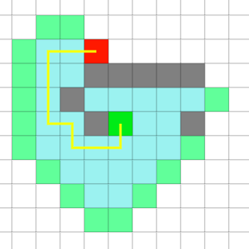
<p>

Operations needed to find goal: **`71`**

### Breadth First-Search

Breadth first-search is **naively** searching for a goal by amassing more states recursively. It works by for every state s, visit all available neighbouring nodes not visited yet. This means that the number of operations in general is larger. <!--But breadth first search is deemed to be a good algorithm to use when the search space is large but the goal is assumed to be relatively nearby.-->

<p align="center">
      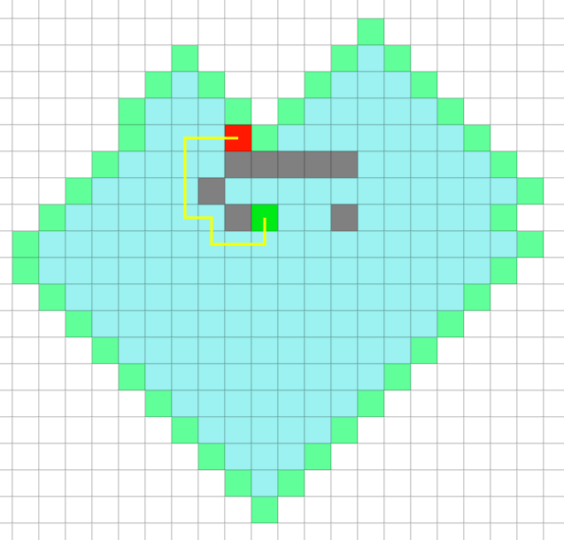
<p>

Operations needed to find goal: **`364`**

### Best First-Search

According to Wikipedia:

_"Best-first search is a search algorithm which explores a graph by expanding the most promising node chosen according to a specified rule."_

Our rule is the lowest manhattan distance. We have a frontier similar to A\*.

The main difference between Best First-search and A* is that the aforementioned priority queue relies solely on the heuristic value. That is why it uses fewer operations than A* for this particular problem. It also terminates when it finds a goal (since `h(x)=0`), which A\* does not immediately do, (it explores `f(x)`:s equal to the goal node).

<p align="center">
      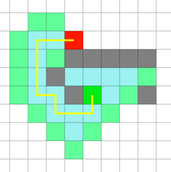
<p>

Operations needed to find goal: **`48`**

## **Comparisions between A\* and Best First-search?**

Compare the two solutions of the same problem below:

|              A\*               |                BFS                 |
| :----------------------------: | :--------------------------------: |
| 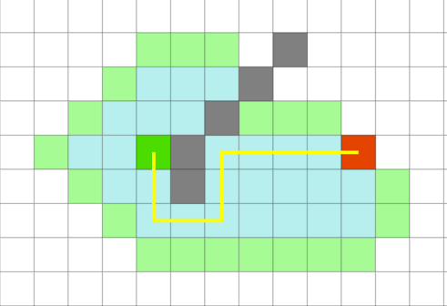 | 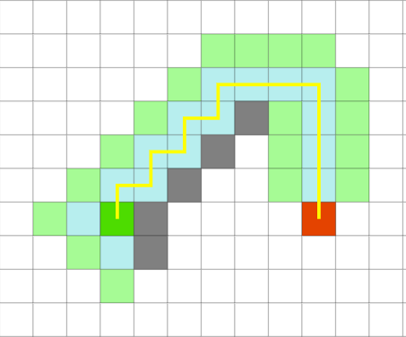 |
|       length: 10, op: 75       |         length: 14, op: 52         |

A\* keeps the promise of finding the optimal path of 10, whilst BFS finds a path of length 14, although with fewer operations.

In the implementation of the algorithm, the priority queue of the BFS appears to prioritize the order of discovery starting from the north and following clockwise. That is why the first iteration goes north and then continues on that path as `h(x)` continues to get lower or equal to the heuristic value of the south-most green nodes neighbor, which is 8 steps (the value of `h(x)` for the diagonal path is 7).

## Which one is fastest?

We find that there are two ways to define fastest in the context of this problem. Either we prioritize the length of the path or the number of operations. We compare A\* and Best First-search as Breadth First-search is not competitive in neither definitions.

For the length of the path, we can always say that A\* is the fastest as it is guaranteed to find the optimal path, something that cannot be said about the BFS.

For the number of operations, it is more problem-dependent. For the problem above the number of operations is fewer in the BFS (compared to A\*). For the problem introduced below the number of operations is greater in the BFS. View the example in the figure below and the data in the following table.

<p align="center">
      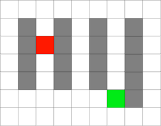
<p>

| example-problem     | **A\*** | **Best First-search** |
| ------------------- | :-------: | :-------: |
| **# of operations** | 36      |  40     |
| **length**          | 7       | 7       |

The software is friendly enough to show the time it took for the program to execute and find the goal. This is shown in the unit of milliseconds and varies for identical rounds when we re-run the solver. We believe that this is not a good metric to estimate time with as it is too unstable. Instead, run time should be approximated using the number of operations. Worth mentioning is that it _might_ not be enough, as different problems may introduce multiple lookups in different parts of the memory when the number of paths become large enough. We deem this aspect to be relevant in large problems but perhaps not in our small problem solved using javascript.

As for an actual direct answer, the solution with the least operations should in theory be the fastest.

# Question 5 - Markov decision processes

[*(a) Discuss when and how the generic search problem can be described as a markov decision process (MDP).*]

We believe a generic search problem can be described as an MDP in the following way:

- The nodes in a general search problem should be described as states in an MDP.

- The out-arcs from a node in a general search problem should in an MDP be described as the possible actions from the corresponding state.
  A node without any out-arcs should have an absorbing state.

- The cost of an arc in a general search problem should be described as a reward of the corresponding action in an MDP. But since it actually is a cost, not a reward, the reward of an action in an MDP should be the negative cost of the corresponding arc. That is, if an arc has a cost of 1, the corresponding action in an MDP should have the reward -1.

- Finally, the MDP should be deterministic. That is, taking action A1 from state S1 should always take you to S2. Hence, the transition probabilities should always be either 0 or 1. An action will either take you to a certain state, or it will not.

_But when is it possible to do this this?_

We find it difficult to come up with almost any requirement that is needed for transforming a general search problem into a MDP. For example it does not matter if:

- **The graph is undirected or directed** - Arcs are described as actions. Making a graph directed only means removing the actions which correspond to arcs previously possible to use.
- **There is a single or several different goal nodes** - The goal node(s) is described as absorbing states. Adding more goal nodes corresponds to adding more absorbing states. E.g value iteration will still find an optimal policy to get to the closest goal node.

However, one requirement we believe is needed is that the **`number of states should be finite`**. The reason behind this requirement is that we do not think it is possible to calculate an optimal policy for an MDP with infinite state space. E.g value iteration performs calculations on all states every iteration, and this will not be possible on an MDP with infinite state space.

<!--- To show an example of how a generic search problem can be described as a MDP we will use the problem from Q4.


- The states of the MDP is all the cells, same as in generic search problem.
- The possible actions at each state (except goal state) is to go up, down, left or right. Each of these actions has a reward of -1.
- The transition probabilities in each cell are uniform.

-->

[*(b) When the search problem can be written as an MDP, what are the advantages and disadvantages of the value iteration algorithm over the A\* algorithm?*]

Advantages

- Value iteration will find the optimal action in each state (optimal policy). This means that by following the optimal policy we can easily get the optimal path from any state to the goal node. A\* will only find the optimal path from a single start node (and the nodes included in the optimal path).

- We do not need to find an admissable heuristic function to use value iteration.

Disadvantages

- Value iteration needs to perform calculations on all the states in every iteration. This will be heavy if the state space is large and hence A\* star will be much quicker.
- Since value iteration in each iteration needs to perform calculations on all states, it will not work if the state space is infinite.
