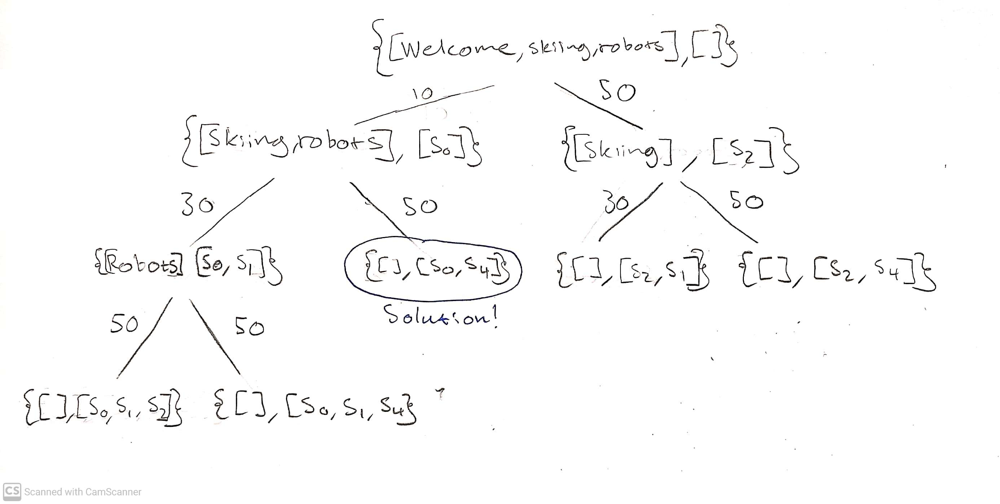
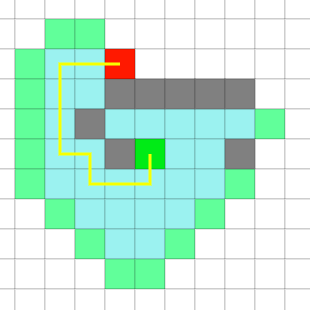
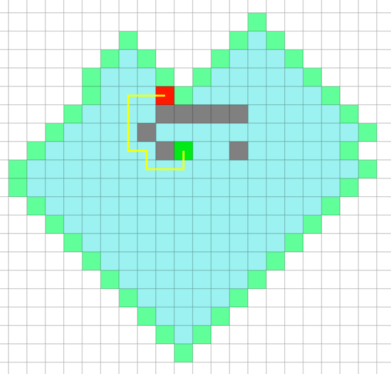
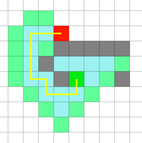

# Question 1:

*[The branching factor ‘d’ of a directed graph is the maximum number of children (outer degree) of a node in the graph. Suppose that the shortest path between the initial state and a goal is of length ‘r’. ]*

### a) 
*[What is the maximum number of BFS iterations required to reach the solution in terms of ‘d’ and ‘r’?]*

BFS, breadth first search will always explore with the frontier and follows a FIFO queue. 

If the shortest path between initial state and goal is 'r', then we have found our solution at depth r. This means that we have traveled through `'r'`-layers. For every layer every node splits to `'d'` children. For simplicity let us assume `d=2``

```
                o           ^
            o       o       | in total 3 splits (r)
          o   o   o   o     | 
         o o o o o o o o    v
```

So for every layer we traverse we earn `d^l` more nodes (where `l` denotes current layer)

We always assume we pick left first and that r is rightmost. In this case then when `d=2` and `r=3` we can express the maximum number of bfs iterations as `sum of d^l, where l = 0,1,..,r-1.   = 7`. For `d=3, r=3` this becomes 13.  

So, in general, the maximum number of BFS iterations to reach a solution can be calculated simply as the total number of nodes.

In terms of `d` and `r` this can be written as:

$$\sum_{i=0}^r d^r$$


### b) 
*[Suppose that storing each node requires one unit of memory and the search algorithm stores each entire path as a string of nodes. Hence, storing a path with k nodes requires k units of memory. What is the maximum amount of memory required for BFS in terms of ‘d’ and ‘r’ ?]*

The total amount of stored paths depend on the current layer (how long a path is) and how many nodes are at the current level (how many unique paths we have). 

For every iteration, `d` new paths arise. At first split 1 path becomes 3, at second split 3 paths become 5, then 7, then 9. This is equal to the nodes of the layer. All these nodes have equal length to initial node. We can then simply multiply depth times width to calculate the memory cost.

Number of nodes at layer is calculated by `d^l` where l is the layer. Say `d=3` and `l=3`, then the total amount of nodes will be 9. Since the height is 3, 3 nodes are required to build each path. The total memory required is then 9 * 3 = 27. 

So, in general, the maximum amount of memory can be calculated as:

```
Number of nodes in last layer*number of nodes in path
```

In terms of `d` and `r` this can be written as: 

$$d^r * (r+1)$$


# Question 2 


## Find all labeling of these three nodes, where DFS will never reach to the goal! Discuss how DFS should be modified to avoid this situation?

<p align="center">
    
<p>

What is important here is to always make the rightmost point in the triangle choose "incorrectly", meaning it should choose to remain in the loop. This means that the "1" must always be placed at the top of the triangle. 3 and 4 can be placed however deemed fit as the arrows indicate which directions that are allowed.


To solve this issue you can use: "Iterative Deepening DFS". That is, we limit the depth of any one path to make sure we do not end up in a loop in the graph. 

In our example, we can by using this change, prevent the algorithm to continue in the loop, and instead make sure it visits the end node. The figures below is an example of how the iterative DFS will work if the labels is chosen to

<pre>
  1
 / \
3 - 4
</pre> 

Depth level 0. Only the first node is visited. 
<pre>
<table align="left" rules="none" >
<td>
<pre>
      1
     / \
<b style="color: red">0</b> - 3 - 4 - 2
</pre>
</td>
</table>
</pre> 

Depth level 1. We reach the second element before reaching the limit. 

<!--- NExt iteration --->
<pre>
<table align="left" rules="none" >
<td>
<pre>
      1
     / \
<b style="color: red">0</b> - 3 - 4 - 2
</pre>
</td>
<td>
<pre>
      1
     / \
<b style="color: red">0</b> - <b style="color: red">3</b> - 4 - 2
</pre>

</td>

</table>
</pre>


Depth level 2

<!--- NExt iteration --->
<pre>
<table align="left" rules="none" >
<td>
<pre>
      1
     / \
<b style="color: red">0</b> - 3 - 4 - 2
</pre>
</td>
<td>
<pre>
      1
     / \
<b style="color: red">0</b> - <b style="color: red">3</b> - 4 - 2
</pre>

</td>

<td>
<pre>
      1
     / \
<b style="color: red">0</b> - <b style="color: red">3</b> - <b style="color: red">4</b> - 2
</pre>

</td>
</table>
</pre>

Depth Level 3. After reaching the node with value of `1` we can not continue deeper because of the limit. Instead we visit the node that is left at depth 3, the end node. 
<!--- NExt iteration --->
<pre>
<table align="left" rules="none" >
<td>
<pre>
      1
     / \
<b style="color: red">0</b> - 3 - 4 - 2
</pre>
</td>
<td>
<pre>
      1
     / \
<b style="color: red">0</b> - <b style="color: red">3</b> - 4 - 2
</pre>

</td>

<td>
<pre>
      1
     / \
<b style="color: red">0</b> - <b style="color: red">3</b> - <b style="color: red">4</b> - 2
</pre>

</td>

</td>

<td>
<pre>
      <b style="color: red">1</b>
     / \
<b style="color: red">0</b> - <b style="color: red">3</b> - <b style="color: red">4</b> - 2
</pre>

</td>


</td>

</td>

<td>
<pre>
      <b style="color: red">1</b>
     / \
<b style="color: red">0</b> - <b style="color: red">3</b> - <b style="color: red">4</b> - <b style="color: red">2</b>
</pre>

</td>

</table>
</pre>


# Question 3: 
[(a) *Suppose that the goal is to cover the topics [welcome,skiing,robots] and the algorithm always selects the leftmost topic to find the neighbors for each node. Draw (by hand) the search space as a tree expanded for a lowest-cost-first search until the first solution is found. This should show all nodes expanded, which node is a goal node, and the frontier when the goal was found.*]

Below is the search space until the first solution for a lowest-cost-first search. The nodes are written as {To_Cover, Segs} and the node marked with `Solution!` is the found goal node.



[(b) *Give a non-trivial heuristic function h that is admissible. [h(n)=0 for all n is the trivial heuristic function.]*]


Our idea is to create a heuristic function that given a node returns an estimate of how many seconds it will take to complete the topics in `To_Cover`. That is, given e.g. {[Skiing, robots], []} our heuristic function should estimate the length it will take to cover the topics skiing and robots. 

However, we know from the lecture that an admissible heuristic function never should overestimate the actual cost.


Hence, our heuristic function should calculate the lowest possible time it will take to cover the topics in `To_Cover`. This will make sure that we never overestimate the actual cost. Note the similarity between this and using the straight-line distance in the shortest-path problem. 

The lowest possible time to cover a topic? Well, that is simply the minimum value of `length / number of topics covered` for all the rows in the database. In our problem, the lowest possible time it will take to cover a topic is **`10 seconds`**.

Hence our heuristic function will simply be
```
Number of topics in To_cover * 10
```


# Question 4
[*Consider the problem of finding a path in the grid shown below from the position s to the position g. A piece can move on the grid horizontally or vertically, one square at a time. No step may be made into a forbidden shaded area. Each square is denoted by the xy coordinate. For example, s is 43 and g is 36. Consider the Manhattan distance as the heuristic.*]


[(a) *Write the paths stored and selected in the first five iterations of the A* algorithm, assuming that in the case of tie the algorithm prefers the path stored first.*]

<p align="center">

<p>

```
iter    step         possible steps             cost

0.                   (*44*,53,42)               (4,6,6)
1.    43 -> 44       (53,42,54,*34*)            (6,6,6,4)
2.    44 -> 34       (*53*,42,54)               (6,6,6)
3.    43 -> 53       (*42*,54,63,52)            (6,6,8,8)
4.    43 -> 42       (*54*,63,52,41,32)         (6,8,8,8,6)
5.    44 -> 54       (63,52,41,*32*,64)         (8,8,8,6,8)
```


[*(b) Solve with software, Use Manhattan distance, no diagonal step and compare A\*, BFS and Best-First- Search. Write a short description about your observation. How does each of these methods reach the solution? Why? Which one is faster?*]

### A*

A-star knows where the goal is, and tries to find a path to it. It uses manhattan distance to "rate" every state based on how it got there as well as how long it is via "manhattan"-distance to the goal. 

When searching, it looks for the "best" state and searches from there.


<p align="center">

<p>


### Breadth First-Search

Breadth first-search is naively searching for a goal by amassing more states recursively. It works by for every state s, visit all available neighbouring nodes not visited yet. This means that the number of operations in general is larger. But breadth first search is deemed to be a good algorithm to use when the search space is large but the goal is assumed to be relatively nearby.


<p align="center">

<p>

### Best First-Search

According to wikipedia:

*"Best-first search is a search algorithm which explores a graph by expanding the most promising node chosen according to a specified rule."*

Our rule is the lowest manhattan distance. We have a frontier similar to A*.

<p align="center">

<p>


## **Why is A\* not the same as Best-First?**
Compare these and discuss why they are not identical.

<p align="center">
      
      
<p>


# Question 5 - Markov decision processes
[*(a) Discuss when and how the generic search problem can be described as a markov decision process (MDP).*]

I think we need to have directional graph?

Finite number of states? 

We believe a generic search problem can be described as a MDP in the following way: 

```
The states in the MDP should be the same as the nodes in the search problem.
```
``` 
The actions possible in a state are the out-arcs one can take from a node. A node without any out-arcs will be an absorbing state.
```
```
The reward of an action in a MDP is the negative cost of the corresponding arc. That is, if an arc has a cost of 1 - the corresponding action in a MDP will have the reward -1. 
```
```
If a node S1 has an arc to another node S2, the transition probability of ending up in state S2 taking action A (corresponding to the arc) in S1 should be 1. All the other transition probabilities for taking action A in S1 should be 0.
```

To show an example of how a generic search problem can be described as a MDP we will use the problem from Q4. 

- The states of the MDP is all the cells, same as in generic search problem. 
- The possible actions at each state (except goal state) is to go up, down, left or right. Each of these actions has a reward of -1.
- The transition probabilities in each cell are uniform.


[*(b) When the search problem can be written as an MDP, what are the advantages and disadvantages of the value iteration algorithm over the A\* algorithm?*]

It is said that A\* always gurantees optimal solution. Maybe value iteration is too heavy with computation?

Advantages
- Value iteration will not only find optimal path, but also what the optimal action is in each state. A* only finds the optimal path.  
- We do not need to find an admissable heuristic function

Disadvantages
- Needs to perform calculations on all the states in every iteration. This will be heavy if the state space is large.  