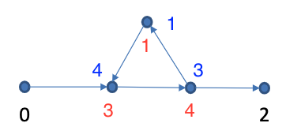

# Question 1:

*[The branching factor ‘d’ of a directed graph is the maximum number of children (outer degree) of a node in the graph. Suppose that the shortest path between the initial state and a goal is of length ‘r’. ]*

### a) 
*[What is the maximum number of BFS iterations required to reach the solution in terms of ‘d’ and ‘r’?]*

BFS, breadth first search will always explore with the frontier and follows a FIFO queue. 

If the shortest path between initial state and goal is 'r', then we have found our solution at depth r. This means that we have traveled through `'r'`-layers. For every layer every node splits to `'d'` children. For simplicity let us assume `d=2``

```
                o           ^
            o       o       | in total 3 splits (r)
          o   o   o   o     | 
         o o o o o o o o    v
```

So for every layer we traverse we earn `d^l` more nodes (where `l` denotes current layer)

We always assume we pick left first and that r is rightmost. In this case then when `d=2` and `r=3` we can express the maximum number of bfs iterations as `sum of d^l, where l = 0,1,..,r-1.   = 7`. For `d=3, r=3` this becomes 13.  

In terms of `d` and `r` the maximum number of iterations can be written as:

$$\sum_{i=0}^r d^r$$


### b) 
*[Suppose that storing each node requires one unit of memory and the search algorithm stores each entire path as a string of nodes. Hence, storing a path with k nodes requires k units of memory. What is the maximum amount of memory required for BFS in terms of ‘d’ and ‘r’ ?]*

The total amount of stored paths depend on the current layer (how long a path is) and how many nodes are at the current level (how many unique paths we have). 

For every iteration, `d` new paths arise. At first split 1 path becomes 3, at second split 3 paths become 5, then 7, then 9. This is equal to the nodes of the layer. All these nodes have equal length to initial node. We can then simply multiply depth times width to calculate the memory cost.

Number of nodes at layer is calculated by `d^l` where l is the layer. Say `d=3` and `l=3`, then the total amount of nodes will be 9. Since the height is 3, 3 nodes are required to build each path. The total memory required is then 9 * 3 = 27. 

So, in general, the maximum amount of memory can be calculated as:

```
Number of nodes in last layer*number of nodes in path
```

In terms of `d` and `r` this can be written as: 

$$d^r * (r+1)$$


# Question 2 


## Find all labeling of these three nodes, where DFS will never reach to the goal! Discuss how DFS should be modified to avoid this situation?

<p align="center">
    
<p>

What is important here is to always make the rightmost point in the triangle choose "incorrectly", meaning it should choose to remain in the loop. This means that the "1" must always be placed at the top of the triangle. 3 and 4 can be placed however deemed fit as the arrows indicate which directions that are allowed.


To solve this issue you use: "Iterative Deepening DFS". That is, we limit the depth of any one path. When the depth limit is 3, this makes it impossible for the algorithm to continue in the loop, but instead it has to visit the end node. The figures below is an example of how the iterative DFS will work if the labels is chosen to

<pre>
  1
 / \
3 - 4
</pre> 

Depth level 0. Only the first node is visited. 
<pre>
      1
     / \
<b style="color: red">0</b> - 3 - 4 - 2
</pre> 

Depth level 1. We reach to second element before reaching the limit. 

<!--- NExt iteration --->
<pre>
<table align="left" rules="none" >
<td>
<pre>
      1
     / \
<b style="color: red">0</b> - 3 - 4 - 2
</pre>
</td>
<td>
<pre>
      1
     / \
<b style="color: red">0</b> - <b style="color: red">3</b> - 4 - 2
</pre>

</td>

</table>
</pre>


Depth level 2

<!--- NExt iteration --->
<pre>
<table align="left" rules="none" >
<td>
<pre>
      1
     / \
<b style="color: red">0</b> - 3 - 4 - 2
</pre>
</td>
<td>
<pre>
      1
     / \
<b style="color: red">0</b> - <b style="color: red">3</b> - 4 - 2
</pre>

</td>

<td>
<pre>
      1
     / \
<b style="color: red">0</b> - <b style="color: red">3</b> - <b style="color: red">4</b> - 2
</pre>

</td>
</table>
</pre>

Depth Level 3. After reaching the node with value of `1` we can not continue deeper because of the limit. Instead we visit the node that is left at depth 3, the end node. 
<!--- NExt iteration --->
<pre>
<table align="left" rules="none" >
<td>
<pre>
      1
     / \
<b style="color: red">0</b> - 3 - 4 - 2
</pre>
</td>
<td>
<pre>
      1
     / \
<b style="color: red">0</b> - <b style="color: red">3</b> - 4 - 2
</pre>

</td>

<td>
<pre>
      1
     / \
<b style="color: red">0</b> - <b style="color: red">3</b> - <b style="color: red">4</b> - 2
</pre>

</td>

</td>

<td>
<pre>
      <b style="color: red">1</b>
     / \
<b style="color: red">0</b> - <b style="color: red">3</b> - <b style="color: red">4</b> - 2
</pre>

</td>


</td>

</td>

<td>
<pre>
      <b style="color: red">1</b>
     / \
<b style="color: red">0</b> - <b style="color: red">3</b> - <b style="color: red">4</b> - <b style="color: red">2</b>
</pre>

</td>

</table>
</pre>